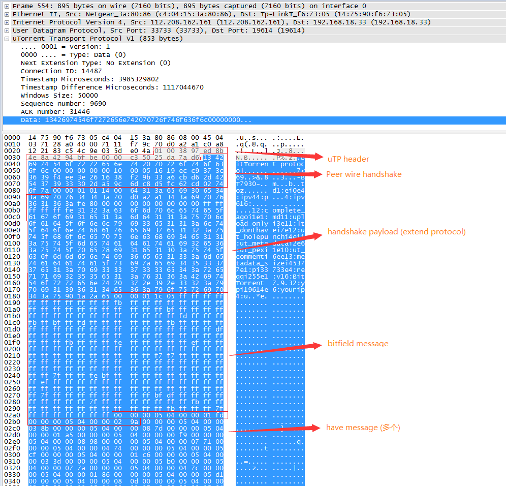

**阅读目录(Content)**

[TOC]

## 一、引言

&emsp;&emsp;平常我们高端用户都会用到BT工具来分享一些好玩的资源，例如ubuntu 13.04的ISO安装盘，一些好听的音乐等。这个时候我们会进入一个叫做P2P的网络，大家都在这个网络里互相传递数据，这种分布式的数据传输解决了HTTP、FTP等单一服务器的带宽压力。

&emsp;&emsp;以往的BT工具（包括现在也有）在加入这个P2P网络的时候都需要借助一个叫**Tracker的中心服务器**，这个服务器是用来登记有哪些用户在请求哪些资源，然后让请求同一个资源的用户都集中在一起互相分享数据，形成的一个集群叫做**Swarm**。这种工作方式有一个弊端就是一旦Tracker服务器出现故障或者线路遭到屏蔽，BT工具就无法正常工作了。所以聪明的人类后来发明了一种叫做DHT（Distributed Hash Table）的去中心化网络。每个加入这个DHT网络的人都要负责存储这个网络里的**资源信息**和**其他成员的联系信息**，相当于所有人一起构成了一个庞大的分布式存储数据库。在DHT里定位一个用户和定位一个资源的方法是一样的，他们都使用SHA－1产生的哈希值来作标识

### Kademlia/DHT/KRPC/BitTorrent之间的关系

&emsp;&emsp;Kademlia是一个最初提出的框架和理论基础，P2P对等资源共享的思想从这里开始衍生，DHT和KRPC是在Kademlia的基础上进行了包装和发展，BitTorrent是在这三者之上的文件共享分发协议

### Magnet URI格式

```
magnet:?xt=urn:btih:<info-hash>&dn=<name>&tr=<tracker-url>
```

-   info-hash：Infohash的16进制编码，共40字符。为了与其它的编码兼容，客户端应当也支持32字符的infohash base32编码

-   xt：是唯一强制的参数

-   dn：是在等待metadata时可能供客户端显示的名字

-   tr：如果只有一个字段，tr是tracker的url；如果有很多的tracker，那么多个tr字段会被包含进去；如果没有指定tracker，客户端应使用DHT来获取peers

    注意：dn和tr都是可选的

### P2P的含义

&emsp;&emsp;从第一个P2P应用系统Napster的出现开始，P2P技术掀起的风暴为互联网带来了一场空前的变革。P2P不是一个全新的概念，P2P理念的起源可以追溯到20世纪80年代。目前，在学术界、工业界对于P2P没有一个统一的定义。Peer在英语里有“(地位、能力等)同等者”、“同事”和“伙伴”等意义，这样一来，P2P也就可以理解为“伙伴对伙伴”的意思，或称为对等网。

&emsp;&emsp;严格地定义纯粹的P2P网络，它是指完全分布的系统，每一个节点都是在功能上和任务上完全相同的。但是这样的定义就会排除掉一些使用“超级节点”的系统或者一些使用中央服务器做一些非核心任务的系统。广义的定义里面指出P2P是一种能善于利用互联网上的存储、CPU周期、内容和用户活动等各种资源的一类应用程序，包括了一些依赖中央服务器才能工作的系统。

&emsp;&emsp;P2P这个定义并不是从系统的结构或者内部的操作特征出发考虑的，而是从人们外在的感知角度出发，如果一个系统从直观上看是各个计算机之间直接互相联系的就可以被叫做P2P。当前，技术上比较权威的定义为，P2P系统是一个由直接相连的节点们所构成的分布式的系统，这些节点能够为了共享内容、CPU 时间、存储或者带宽等资源而自我形成一定的网络拓扑结构，能够在适应节点数目的变化和失效的同时维持可以接受的链接能力和性能，并且不需要一个全局服务器或者权威的中介的支持。本文从人们感知的角度出发，采用P2P的广义定义。

**Relevant Link:**

> http://blog.csdn.net/xxxxxx91116/article/details/8549454


## 二、Kademlia协议

### Kademlia

&emsp;&emsp;Kademlia是一种通过分散式杂凑表实现的协议算法，它是由Petar和David为非集中式P2P计算机网络而设计的

&emsp;&emsp;Kademlia规定了**网络的结构**，也规定了**通过节点查询**进行**信息交换**的方式。

&emsp;&emsp;Kademlia网络节点之间使用**UDP**进行通讯。

&emsp;&emsp;参与通讯的所有节点形成一张虚拟网（或者叫做覆盖网）。这些节点通过一组数字（或称为节点ID）来进行身份标识。==**节点ID**不仅可以用来做**身份标识**，还可以用来进行**值定位**（值通常是文件的散列或者关键词）==。其实，节点ID与文件散列直接对应，它所表示的那个节点存储着**获取文件和资源的位置信息**。

&emsp;&emsp;当我们在网络中搜索某些值（即通常搜索存储文件散列或关键词的节点）的时候，Kademlia算法需要知道与这些值相关的键，然后**分步在网络中开始搜索**。==每一步都会找到一些节点，这些节点的ID与键更为接近，如果有节点直接返回搜索的值或者再也无法找到与键更为接近的节点ID的时候搜索便会停止==。这种搜索值的方法是非常高效的。

&emsp;&emsp;与其他的分散式杂凑表的实现类似，在一个包含n个节点的系统的值的搜索中，Kademlia仅访问O(log(n))个节点。==非集中式网络结构还有更大的优势，那就是它能够显著增强抵御拒绝服务攻击的能力==。即使网络中的一整批节点遭受泛洪攻击，也不会对网络的可用性造成很大的影响，通过绕过这些漏洞（被攻击的节点）来重新编织一张网络，网络的可用性就可以得到恢复。

### p2p网络架构演进

1.  第一代P2P文件分享网络，像Napster，依赖于中央数据库来协调网络中的查询
2.  第二代P2P网络，像Gnutella，使用泛滥式查询（query flooding）来查询文件，它会搜索网络中的所有节点
3.  第三代p2p网络使用分散式杂凑表来查询网络中的文件，分散式杂凑表在整个网络中储存资源的位置

&emsp;&emsp;这些协议追求的主要目标就是快速定位期望的节点。Kademlia基于两个节点之间的距离计算，该距离是**两个网络节点ID号的异或**，计算的结果最终作为整型数值返回。==关键字和节点ID有同样的格式和长度，因此，可以使用同样的方法计算关键字和节点ID之间的距离==。

&emsp;&emsp;节点ID一般是一个**大的随机数**，选择该数的时候所追求的一个目标就是它的唯一性（希望在整个网络中该节点ID是唯一的）。==异或距离跟实际上的地理位置没有任何关系，只与ID相关==。因此很可能来自德国和澳大利亚的节点由于选择了相似的随机ID而成为邻居。选择异或是因为通过它计算的距离享有几何距离公式的一些特征，尤其体现在以下几点：

1.  节点和它本身之间的异或距离是0
2.  异或距离是对称的：即从A到B的异或距离与从B到A的异或距离是等同的
3.  异或距离符合三角不等式: 三个顶点A-B-C，AC异或距离小于或等于AB异或距离和BC异或距离之和，这种几何数学特征，可以很好的支撑算法进行寻路路由

&emsp;&emsp;基于上述属性，在实际的节点距离的度量过程中计算量将大大降低。==Kademlia搜索的每一次迭代将距目标至少更近1 bit（每次根据XOR结果，往前选择1bit更近的节点）==。一个基本的具有2的n次方个节点的Kademlia网络在最坏的情况下只需花n步就可找到被搜索的节点或值。

&emsp;&emsp;因为Kademlia是根据bit位XOR计算得到**相对距离**的，==对于越低bit位，XOR可能得到的结果越小；对于越高位的bit位，XOR可能得到的值就越大，并且是呈现2的指数方式增长的==。所以，从数学上来说，一个DHT网络中的所有节点，通过这种方式（XOR距离）进行寻址，每次前进一个bit，最大只需要log2N次即可到达目标节点(（log2逼近的思路，即bit 2可以表示世界上任何数字）。

### 路由表

&emsp;&emsp;Kademlia路由表由多个列表组成，==每个列表对应节点ID的一位（例如：假如节点ID共有6位，则节点的路由表将包含6个列表），一个列表中包含多个条目，条目中包含定位其他节点所必要的一些数据==。

列表条目中的这些数据通常是由其他节点的**IP地址、端口和节点ID**组成。

**示例**：节点ID的一位就是1bit，假设我们的节点ID是: 111000

1. 对第一个K桶来说，它的列表中的条目必须第一bit不能是1，因为第一个K桶的含义是和该节点的距离是最远的一个分组，第一位不为1，它背后的含义是该分组里的节点和该节点的距离至少在2^6以上，它代表了整个网络中和该节点逻辑距离最远的一些节点，它的列表条目是这样的：0 00000 ~ 0 111111

2. 对第二个K桶来说，它的列表中的条目的第一位必须是1，表示和当前节点的第一bit相同，第二bit不能是1，这样代表的意思是第二个K桶里的节点和该节点的距离是介于MAX(2 bit)和MIN(1 bit)之间的距离，它的列表条目是这样的: 10 0000 ~ 10 1111

3. 对第三个K桶的情况和前2个相同，类推

4. 对第四个K桶的来说，它的列表中的条目前三位都是1，第四位不是0，它的列表条目是这样的: 1111 00 ~ 1111 11

5. 后面的bit位情况类推，可以看出，越低bit位的K桶的MAX(XOR)就越小，它的可变范围就越小了。这代表了越低bit位的K桶里存储的都是距离当前节点越近的Nod节点

&emsp;&emsp;条目列表以节点ID的一位（即1 bit）来分组是有道理的：我们使用log~2~N的指数分级方法把除当前节点的全网所有节点都进行了分组，当别的节点来向当前节点请求某个资源HASH的时候，将待搜索寻址的"目标节点ID"和路由表进行异或，会有两种情况：

- 找到某个条目和目标节点XOR为0，即已经寻址成功，则直接返回这个条目给requester即可

- 如果没找到XOR结果为0的条目，则选取那个XOR值最小的条目对应的K桶中的K个条目返回给requester，因为这些条目是最有可能存储了目标节点ID条目的

&emsp;&emsp;每个列表对应于与节点相距**“特定范围距离”**的一些节点，==节点的第n个列表中所找到的节点的第n位与该节点的第n位肯定不同，而前n-1位相同，这就意味着很容易使用网络中远离该节点的一半节点来填充第一个列表（第一位不同的节点最多有一半）==，而用网络中四分之一的节点来填充第二个列表（比第一个列表中的那些节点离该节点更近一位）。依次类推。如果ID有128个二进制位，则网络中的每个节点按照不同的异或距离把其他所有的节点分成了128类，ID的每一位对应于其中的一类。

&emsp;&emsp;随着网络中的节点被某节点发现，它们被逐步加入到该节点的相应的列表中，这个过程中包括向节点列表中存信息（录入别的节点发布的声明和从节点列表中取信息的操作），甚至还包括当时协助其他节点寻找相应键对应值的操作（转发其他节点的寻址请求）。==这个过程中发现的所有节点都将被加入到节点的列表之中，因此节点对整个网络的感知是动态的，这使得网络一直保持着频繁地更新，增强了抵御错误和攻击的能力==。

&emsp;&emsp;在Kademlia相关的论文中，列表也称为：**K桶**，其中K是一个**系统变量**，如20，每一个K桶是一个最多包含K个条目的列表，也就是说，网络中所有节点的一个列表(对应于某一位，与该节点相距一个特定的距离)最多包含20个节点。==随着对应的bit位变低(即：对应的异或距离越来越短)(bit位越小，可能的距离MAX值就越小了，即距离目标节点的距离越近)，K桶包含的可能节点数迅速下降(K定义的是该bit对应的列表最多能存储K个条目，但不一定都是K存满，当到最低几个bit位的时候，K桶里可能就只有几个个位数的条目了)==。

&emsp;&emsp;由于网络中节点的实际数量远远小于可能ID号的数量，所以==对应那些短距离的某些K桶可能一直是空的==(如果异或距离只有1，可能的数量就最大只能为1，这个异或距离为1的节点如果没有发现，则对应于异或距离为1的K桶则是空的)


从这个逻辑图中可以看出：

&emsp;&emsp;节点的HASH值决定了它们的逻辑距离，即Kademlia网络中的下一跳寻址是根据HASH XOR的值范围(数值大小范围)结果决定的，_该网络最大可有2^3，即8个关键字和节点，目前共有7个节点加入，每个节点用一个小圈表示(在树的底部)。_

__考虑那个用黑圈标注的节点6，它共有3个K桶(即3bit位)__

节点0，1和2(二进制表示为000，001和010)是第一个K桶的候选节点

-   000 -> 110: 6
-   001 -> 110: 5
-   010 -> 110: 4

节点3目前(二进制表示为011)还没有加入网络

节点4和节点5(二进制表示分别为100和101)是第二个K桶的候选节点

-   100 -> 110: 2
-   101 -> 110: 1

节点7(二进制表示为111)是第3个K桶的候选节点

-   111 -> 110: 1

&emsp;&emsp;图中3个K桶都用灰色圈表示，假如K桶的大小(即K值)是2，那么第一个K桶只能包含3个节点中的2个。众所周知，那些长时间在线连接的节点未来长时间在线的可能性更大，基于这种静态统计分布的规律，Kademlia选择把那些长时间在线的节点存入K桶，这一方法增长了未来某一时刻有效节点的数量(hot hint)，同时也提供了更为稳定的网络。

&emsp;&emsp;当某个K桶已满，而又发现了相应于该桶的新节点的时候，那么，就首先检查K桶中最早访问的节点，假如该节点仍然存活，那么新节点就被安排到一个附属列表中(作为一个替代缓存). 只有当K桶中的某个节点停止响应的时候，替代cache才被使用。换句话说，新发现的节点只有在老的节点消失(失效)后才被使用。

### 协议消息

Kademlia协议共有四种消息：

1.  **PING消息**：用来测试节点是否仍然在线
2.  **STORE消息**：在某个节点中存储一个键值对
3.  **FIND\_NODE消息**：消息请求的接收者将返回自己桶中离请求键值最近的K个节点，被请求者将请求者请求的节点HASH和自己的HASH进行XOR计算，将计算结果
4.  **FIND\_VALUE消息**：与FIND\_NODE一样，不过当请求的接收者存有请求者所请求的键的时候，它将返回相应键的值

每一个RPC消息中都包含一个发起者加入的随机值，这一点确保响应消息在收到的时候能够与前面发送的请求消息匹配

### 定位节点

节点查询可以**异步进行**，也可以**同时进行**，==同时查询的数量由α表示，一般是3==。查询步骤为：

1. 在节点查询的时候，它先得到它K桶中离所查询的键值最近的K个节点(XOR值最小的那个条目所在的分组)，然后向这K个节点发起FIND_NODE消息请求(因为这个K桶内的节点最有可能寻址成功)
2. 消息接收者收到这些请求消息后将在他们的K桶中进行查询，如果他们知道离被查键更近的节点，他们就返回这些节点(最多K个)
   
    1) 找到某个条目和目标节点XOR为0，即已经寻址成功，则直接返回这个条目给requester即可
    
    2) 如果没找到XOR结果为0的条目，则选取那个XOR值最小的条目对应的K桶中的K个条目返回给requester，因为这些条目是最有可能存储了目标节点ID条目的
3. 消息的请求者在收到响应后将使用它所收到的响应结果来更新它的结果列表，返回的结果也应该插入到刚才发起请求的那个K桶里，这个结果列表总是保持K个响应FIND_NODE消息请求的最优节点(即离被搜索键更近的K个节点) 
4. 然后消息发起者将向这K个最优节点发起查询，因为刚开始的查询很可能K桶里存的不全是目标节点，而是潜在地离目标节点较近的节点
5. 不断地迭代执行上述查询过程。因为每一个节点比其他节点对它周边的节点有更好的感知能力(水波扩散式的节点寻址方式)，因此响应结果将是一次一次离被搜索键值越来越近的某节点。如果本次响应结果中的节点没有比前次响应结果中的节点离被搜索键值更近了(即发现这轮查询的结果未发生diff变化了)，这个查询迭代也就终止了
6. 当这个迭代终止的时候，响应结果集中的K个最优节点就是整个网络中离被搜索键值最近的K个节点(从以上过程看，这显然是局部的，而非整个网络，因为这本质和最优解搜索算法一样，可能陷入局部最优解而无法获得全局最优解) 
7. 节点信息中可以增加一个往返时间，或者叫做RTT的参数，这个参数可以被用来定义一个针对每个被查询节点的超时设置，即当向某个节点发起的查询超时的时候，另一个查询才会发起，当然，针对某个节点的查询在同一时刻从来不超过α个

### 定位和冗余拷贝资源

&emsp;&emsp;通过把资源信息与键进行映射，资源即可进行定位，哈希表是典型的用来映射的手段。由于以前的STORE消息，存储节点将会有对应STORE所存储的相关资源的信息。定位资源时，如果一个节点存有相应的资源的值的时候，它就返回该资源，搜索便结束了。除了该点以外，定位资源与定位离键最近的节点的过程相似： 

1. 考虑到节点未必都在线的情况，资源的值被存在多个节点上(节点中的K个)，并且，为了提供冗余，还有可能在更多的节点上储存值；
2. ==储存值的节点将定期搜索网络中与储存值所对应的键接近的K个节点并且把值复制到这些节点上，这些节点可作为那些下线的节点的补充==；
3. 另外，对于那些普遍流行的内容，可能有更多的请求需求，通过让那些访问值的节点把值存储在附近的一些节点上(不在K个最近节点的范围之类)来减少存储值的那些节点的负载，这种新的存储技术就是缓存技术。通过这种技术，依赖于请求的数量，资源的值被存储在离键越来越远的那些节点上==(资源热度越高，缓存cache就越广泛)==，这使得那些流行的搜索可以更快地找到资源的储存者；
5. 由于返回值的节点的NODE_ID远离值所对应的关键字，网络中的"热点"区域存在的可能性也降低了。依据与键的距离，缓存的那些节点在一段时间以后将会删除所存储的缓存值。==DHT的某些实现(如Kad)即不提供冗余(复制)节点也不提供缓存，这主要是为了能够快速减少系统中的陈旧信息==。在这种网络中，提供文件的那些节点将会周期性地更新网络上的信息(通过**NODE_LOOKUP**消息和**STORE**消息)。==当存有某个文件的所有节点都下线了，关于该文件的相关的值(源和关键字)的更新也就停止了，该文件的相关信息也就从网络上完全消失了== 。


### 加入网络

加入网络的流程：

1. 想要加入网络的节点首先要经历一个引导过程。在引导过程中，节点需要知道其他已加入该网络的某个节点的IP地址和端口号(可从用户或者存储的列表中获得)。假如正在引导的那个节点还未加入网络，它会计算一个目前为止还未分配给其他节点的随机ID号，直到离开网络，该节点会一直使用该ID号 
2. 正在加入Kademlia网络的节点在它的某个K桶中插入引导节点(加入该网络的介绍人)(负责加入节点的初始化工作)，然后向它的唯一邻居(引导节点)发起NODE_LOOKUP操作请求来定位自己，这种"自我定位"将使得Kademlia的其他节点(收到请求的节点)能够使用新加入节点的Node Id填充他们的K桶(邻居互相认识)
3. 同时也能够使用那些查询过程的中间节点(位于新加入节点和引导节点的查询路径上的其他节点)来填充新加入节点的K桶(相当于完成一个DNS递归查询后，沿途路径上的DNS IP都被记录了)。想象一下这个过程
    1) 新加入的节点可能和"引导节点"距离很远，它一上来就向离自己几何距离最远的引导节点问话: "谁知道我自己这个节点在哪?"，引导节点会尽力去回答这个问题，即引导节点会把自己K桶内最有可能知道该节点位置(即离该几点XOR几何距离最近的K个点返回给新加入的请求节点)
    2) 新加入的请求方收到了K个节点后，把这K个节点保存进自己的K桶，然后继续向这些节点去"询问(发起find_node请求)"自己的节点在哪，这些节点会收到这些请求，同时也把新加入节点保存进自己的K桶内
    3) 整个过程和向DNS根域名服务器请求解析某个域名的递归过程类似
4. 这一自查询过程使得新加入节点自引导节点所在的那个K桶开始，由远及近，对沿途的所有节点逐步得到刷新，整条链路上的邻居都认识了这个新邻居
5. 最初的时候，节点仅有一个K桶(覆盖所有的ID范围)，当有新节点需要插入该K桶时，如果K桶已满，K桶就开始分裂，分裂发生在节点的K桶的覆盖范围(表现为二叉树某部分从左至右的所有值)包含了该节点本身的ID的时候。对于节点内距离节点最近的那个K桶，Kademlia可以放松限制(即可以到达K时不发生分裂)，因为桶内的所有节点离该节点距离最近，这些节点个数很可能超过K个，而且节点希望知道所有的这些最近的节点。因此，在路由树中，该节点附近很可能出现高度不平衡的二叉子树。假如K是20，新加入网络的节点ID为"xxx000011001"，则前缀为"xxx0011..."的节点可能有21个，甚至更多，新的节点可能包含多个含有21个以上节点的K桶(位于节点附近的k桶)。这点保证使得该节点能够感知网络中附近区域的所有节点 


### 查询加速

1. Kademlia使用异或来定义距离。两个节点ID的异或(或者节点ID和关键字的异或)的结果就是两者之间的距离。对于每一个二进制位来说，如果相同，异或返回0，否则，异或返回1。==异或距离满足三角形不等式: 任何一边的距离小于(或等于)其它两边距离之和==
2. 异或距离使得Kademlia的路由表可以建在单个bit之上，即可使用位组(多个位联合)来构建路由表。位组可以用来表示相应的K桶，它有个专业术语叫做前缀，==对一个m位的前缀来说，可对应2^m-1^个K桶(m位的前缀本来可以对应2^m^个K桶)另外的那个K桶可以进一步扩展为包含该节点本身ID的路由树==
3. 一个==b位的前缀可以把查询的最大次数从logn减少到logn/b==。并且这只是查询次数的最大值，因为自己K桶可能比前缀有更多的位与目标键相同，这会增加在自己K桶中找到节点的机会，假设前缀有m位，很可能查询一个节点就能匹配2^m^甚至更多的位组，所以其实平均的查询次数要少的多 
4. 节点可以在他们的路由表中使用**混合前缀**，就像eMule中的Kad网络。如果以增加查询的复杂性为代价，Kademlia网络在路由表的具体实现上甚至可以是有异构的


## 三、文件分享网络中的应用

### 1.Kademlia的应用

&emsp;&emsp;Kademlia可在文件分享网络中使用，通过制作Kademlia关键字搜索，我们能够在文件分享网络中找到我们需要的文件以供我们下载。由于没有中央服务器存储文件的索引，这部分工作就被平均地分配到所有的客户端中去

1. 假如一个节点希望分享某个文件，它先根据文件的内容来处理该文件，通过运算，把文件的内容散列成一组数字，该数字在文件分享网络中可被用来标识文件
2. 这组散列数字必须和节点ID有同样的长度，然后，该节点便在网络中搜索ID值与文件的散列值相近的节点，然后向这些被搜索到的节点广播自己(即把它自己的IP地址存储在那些搜索到的节点上)，本质意思是说: "你如果要搜索这个文件，就去找那些节点ID就好了，那些节点ID会告诉搜索者应该到自己这里来(文件发布者)来建立TCP连接，下载文件"，也就是说，它把自己作为文件的源进行了发布(文件共享方式)。正在进行文件搜索的客户端将使用Kademlia协议来寻找网络上ID值与希望寻找的文件的散列值最近的那个节点(寻找文件的过程和寻找节点的机制形成了统一，因为文件和节点的ID的HASH格式是一样的)，然后取得存储在那个节点上的文件源列表 
3. 由于一个键(HASH)可以对应很多值，即同一个文件(通过一个对应的HASH公布到P2P网络中)可以有多个源(因为可能有多个节点都会有这个文件的拷贝)，每一个存储源列表的节点可能有不同的文件的源的信息，这样的话，源列表可以从与键值相近的K个节点获得。 文件的散列值通常可以从其他的一些特别的Internet链接的地方获得，或者被包含在从其他某处获得的索引文件中(即种子文件)
4. 文件名的搜索可以使用关键词来实现，文件名可以分割成连续的几个关键词，这些关键词都可以散列并且可以和相应的文件名和文件散列储存在网络中。搜索者可以使用其中的某个关键词，联系ID值与关键词散列最近的那个节点，取得包含该关键词的文件列表。由于在文件列表中的文件都有相关的散列值，通过该散列值就可利用上述通常取文件的方法获得要搜索的文件 

**Relevant Link:**

> https://zh.wikipedia.org/wiki/Kademlia
>
> http://file.scirp.org/pdf/3-4.3.pdf


### 2\. KRPC 协议 KRPC Protocol

&emsp;&emsp;**KRPC是BitTorrent在Kademlia理论基础之上定义的一个通信消息格式协议，主要用来支持peer节点的获取(get_peer)、peer节点的声明(announce_peer)、判活心跳(ping)、节点寻址(find_node)，它在find_node的原理上和DHT是一样的，同时增加了get_peer/announce_peer/ping协议的支持**

KRPC协议是由B编码组成的一个简单的RPC结构，有4种请求：ping、find\_node、get\_peers 和 announce\_peer

_**0x0: bencode编码**_

bencode 有 4 种数据类型: string, integer, list 和 dictionary

```
1. string: 字符是以这种方式编码的: <字符串长度>:<字符串> 
如 hell: 4:hell

2. integer: 整数是一这种方式编码的: i<整数>e 
如 1999: i1999e

3. list: 列表是一这种方式编码的: l[数据1][数据2][数据3][…]e 
如列表 [hello, world, 101]：l5:hello5:worldi101ee

4. dictionary: 字典是一这种方式编码的: d[key1][value1][key2][value2][…]e，其中 key 必须是 string 而且按照字母顺序排序 
如字典 {aa:100, bb:bb, cc:200}： d2:aai100e2:bb2:bb2:cci200ee
```

KRPC 协议是由 bencode 编码组成的一个简单的 RPC 结构，他使用 UDP 报文发送。一个独立的请求包被发出去然后一个独立的包被回复。这个协议没有重发(UDP是无连接协议)

_**0x1: KRPC字典基本组成元素**_

一条 KRPC 消息即可能是request，也可能是response，由一个独立的字典组成：

```yaml
1. t关键字: 每条消息都包含 t 关键字，它是一个代表了 transaction ID 的字符串。transaction ID 由请求节点产生，并且回复中要包含回显该字段(挑战-响应模型)，所以回复可能对应一个节点的多个请求。transaction ID 应当被编码为一个短的二进制字符串，比如 2 个字节，这样就可以对应 2^16 个请求
2. y关键字: 它由一个字节组成，表明这个消息的类型。y 对应的值有三种情况：
    1) q 表示请求(请求Queries): q类型的消息它包含 2 个附加的关键字 q 和 a
        1.1) 关键字 q: 是字符串类型，包含了请求的方法名字(get_peers/announce_peer/ping/find_node)
        1.2) 关键字 a: 一个字典类型包含了请求所附加的参数(info_hash/id..)
    2) r 表示回复(回复 Responses): 包含了返回的值。发送回复消息是在正确解析了请求消息的基础上完成的，包含了一个附加的关键字 r。关键字 r 是字典类型
        2.1) id: peer节点id号或者下一跳DHT节点
                2.2) nodes": "" 
                2.3) token: token
    3) e 表示错误(错误 Errors): 包含一个附加的关键字 e，关键字 e 是列表类型
        3.1) 第一个元素是数字类型，表明了错误码，当一个请求不能解析或出错时，错误包将被发送。下表描述了可能出现的错误码
        201: 一般错误
        202: 服务错误
        203: 协议错误，比如不规范的包，无效的参数，或者错误的 toke
        204: 未知方法 
        3.2) 第二个元素是字符串类型，表明了错误信息
```

以上是整个KRPC的协议框架结构，具体到请求Query/回复Response/错误Error还有具体的协议实现

_**0x2: 请求Query具体协议**_

所有的请求都包含一个关键字 id，它包含了请求节点的节点 ID。所有的回复也包含关键字id，它包含了回复节点的节点 ID

**1\. ping:** 检测节点是否可达，请求包含一个参数id，代表该节点的nodeID。对应的回复也应该包含回复者的nodeID

```
ping Query = {"t":"aa", "y":"q", "q":"ping", "a":{"id":"abcdefghij0123456789"}}
bencoded = d1:ad2:id20:abcdefghij0123456789e1:q4:ping1:t2:aa1:y1:qe

Response = {"t":"aa", "y":"r", "r": {"id":"mnopqrstuvwxyz123456"}}
bencoded = d1:rd2:id20:mnopqrstuvwxyz123456e1:t2:aa1:y1:re
```

**2\. find\_node:** find\_node 被用来查找给定 ID 的DHT节点的联系信息，该请求包含两个参数id(**代表该节点的nodeID**)和target。回复中应该包含被请求节点的路由表中距离target最接近的K个nodeID以及对应的nodeINFO

```
find_node Query = {"t":"aa", "y":"q", "q":"find_node", "a": {"id":"abcdefghij0123456789", "target":"mnopqrstuvwxyz123456"}}
# "id" containing the node ID of the querying node, and "target" containing the ID of the node sought by the queryer. 
bencoded = d1:ad2:id20:abcdefghij01234567896:target20:mnopqrstuvwxyz123456e1:q9:find_node1:t2:aa1:y1:qe

Response = {"t":"aa", "y":"r", "r": {"id":"0123456789abcdefghij", "nodes": "def456..."}}
bencoded = d1:rd2:id20:0123456789abcdefghij5:nodes9:def456...e1:t2:aa1:y1:re
```

**find\_node 请求包含 2 个参数，第一个参数是 id，包含了请求节点的ID。第二个参数是 target，包含了请求者正在查找的节点的 ID**


&emsp;&emsp;**当一个节点接收到了 find\_node 的请求，他应该给出对应的回复，回复中包含 2 个关键字 id(被请求节点的id) 和 nodes，nodes 是字符串类型，包含了被请求节点的路由表中最接近目标节点的 K(8) 个最接近的节点的联系信息(被请求方每次都统一返回最靠近目标节点的节点列表K捅)**


```
参数: {"id" : "<querying nodes id>", "target" : "<id of target node>"}
回复: {"id" : "<queried nodes id>", "nodes" : "<compact node info>"}
```

这里要明确3个概念：

1. **请求方的id**: 发起这个DHT节点寻址的节点自身的ID，可以类比DNS查询中的客户端
2. **目标target id**: 需要查询的目标ID号，可以类比于DNS查询中的URL，这个ID在整个递归查询中是一直不变的
3. **被请求节点的id**: 在节点的递归查询中，请求方由远及近不断询问整个链路上的节点，沿途的每个节点在返回时都要带上自己的id号

**3\. get\_peers**

```
1. get_peers 请求包含 2 个参数(id请求节点ID，info_hash代表torrent文件的infohash，infohash为种子文件的SHA1哈希值，也就是磁力链接的btih值)
2. response get_peer: 
    1) 如果被请求的节点有对应 info_hash 的 peers，他将返回一个关键字 values，这是一个列表类型的字符串。每一个字符串包含了 "CompactIP-address/portinfo" 格式的 peers 信息(即对应的机器ip/port信息)(peer的info信息和DHT节点的info信息是一样的)
    2) 如果被请求的节点没有这个 infohash 的 peers，那么他将返回关键字 nodes(需要注意的是，如果该节点没有对应的infohash信息，而只是返回了nodes，则请求方会认为该节点是一个"可疑节点"，则会从自己的路由表K捅中删除该节点)，这个关键字包含了被请求节点的路由表中离 info_hash 最近的 K 个节点(我这里没有该节点，去别的节点试试运气)，使用 "Compactnodeinfo" 格式回复。在这两种情况下，关键字 token 都将被返回。token 关键字在今后的 annouce_peer 请求中必须要携带。token 是一个短的二进制字符串
```

 

> infohash = 1619ecc9373c3639f4ee3e261638f29b33a6cbd6，正是磁力链接magnet:?xt=urn:btih:1619ecc9373c3639f4ee3e261638f29b33a6cbd6&dn;=ubuntu-14.10-desktop-i386.iso中的btih值

```yaml
get_peers Query = {"t":"aa", "y":"q", "q":"get_peers", "a": {"id":"abcdefghij0123456789", "info_hash":"mnopqrstuvwxyz123456"}}
bencoded = d1:ad2:id20:abcdefghij01234567899:info_hash20:mnopqrstuvwxyz123456e1:q9:get_peers1:t2:aa1:y1:qe

Response with peers = {"t":"aa", "y":"r", "r": {"id":"abcdefghij0123456789", "token":"aoeusnth", "values": ["axje.u", "idhtnm"]}}
bencoded = d1:rd2:id20:abcdefghij01234567895:token8:aoeusnth6:valuesl6:axje.u6:idhtnmee1:t2:aa1:y1:re

Response with closest nodes = {"t":"aa", "y":"r", "r": {"id":"abcdefghij0123456789", "token":"aoeusnth", "nodes": "def456..."}}
bencoded = d1:rd2:id20:abcdefghij01234567895:nodes9:def456...5:token8:aoeusnthe1:t2:aa1:y1:re
```

框架格式:

```yaml
参数: {"id" : "<querying nodes id>", "info_hash" : "<20-byte infohash of target torrent>"}
回复: 
{"id" : "<queried nodes id>", "token" :"<opaque write token>", "values" : ["<peer 1 info string>", "<peer 2 info string>"]}
或: 
{"id" : "<queried nodes id>", "token" :"<opaque write token>", "nodes" : "<compact node info>"}
```

get\_peers请求的回复：回复报文中包含了8个node，以及100个peer。可见包含该种子文件的peer非常多


**4\. announce\_peer: 这个请求用来表明发出 announce\_peer 请求的节点，正在某个端口下载 torrent 文件**

announce\_peer 包含 4 个参数:

1. 第一个参数是 id: 包含了请求节点的 ID
2. 第二个参数是 info_hash: 包含了 torrent 文件的 infohash
3. 第三个参数是 port: 包含了整型的端口号，表明 peer 在哪个端口下载
4. 第四个参数数是 token: 这是在之前的 get_peers 请求中收到的回复中包含的。收到 announce_peer 请求的节点必须检查这个 token 与之前我们回复给这个节点 get_peers 的 token 是否相同(也就说，所有下载者/发布者都要参与检测新加入的发布者是否伪造了该资源，但是这个机制有一个问题，如果最开始的那个发布者就伪造，则整条链路都是一个伪造的错的资源infohash信息了)
    如果相同，那么被请求的节点将记录发送 announce_peer 节点的 IP 和请求中包含的 port 端口号在 peer 联系信息中对应的 infohash 下，这意味着一个一个事实: 当前这个资源有一个新的peer提供者了，下一次有其他节点希望或者这个资源的时候，会把这个新的(前一次请求下载资源的节点)也当作一个peer返回给请求者，这样，资源的提供者就越来越多，资源共享速度就越来越快


&emsp;&emsp;一个peer正在下载某个资源，意味着该peer有能够访问到该资源的渠道，且该peer本地是有这份资源的全部或部分拷贝的，它需要向DHT网络广播announce消息，告诉其他节点这个资源的下载地址

```yaml
arguments:  {"id" : "<querying nodes id>",
"implied_port": <0 or 1>,
"info_hash" : "<20-byte infohash of target torrent>",
"port" : <port number>,
"token" : "<opaque token>"}

response: {"id" : "<queried nodes id>"}
```

报文包例子 Example Packets ：

```yaml
announce_peers Query = {"t":"aa", "y":"q", "q":"announce_peer", "a": {"id":"abcdefghij0123456789", "implied_port": 1, "info_hash":"mnopqrstuvwxyz123456", "port": 6881, "token": "aoeusnth"}}
bencoded = d1:ad2:id20:abcdefghij01234567899:info_hash20:<br />
mnopqrstuvwxyz1234564:porti6881e5:token8:aoeusnthe1:q13:announce_peer1:t2:aa1:y1:qe

Response = {"t":"aa", "y":"r", "r": {"id":"mnopqrstuvwxyz123456"}}
bencoded = d1:rd2:id20:mnopqrstuvwxyz123456e1:t2:aa1:y1:re
```

_**0x3: 回复 Responses**_

回复 Responses的包已经在上面的Query里说明了

_**0x4: 错误 Errors**_

错误包例子 Example Error Packets

```yaml
generic error = {"t":"aa", "y":"e", "e":[201, "A Generic Error Ocurred"]}
bencoded = d1:eli201e23:A Generic Error Ocurrede1:t2:aa1:y1:ee
```

**Relevant Link:**

> http://www.bittorrent.org/beps/bep_0005.html
>
> https://segmentfault.com/a/1190000002528378
>
> https://github.com/wuzhenda/simDHT
>
> https://wenku.baidu.com/view/9a7b447aa26925c52cc5bfc9.html
>
> http://www.bittorrent.org/beps/bep_0005.html


### 3.DHT 公网嗅探器实现(DHT 爬虫)

在开始研究BitTorrent协议之前，我们先来了解下DHT协议上存在的一个缺点导致的一个攻击面: 嗅探攻击

**0x1: DHT嗅探器的原理**

DHT这种对等分布式网络在带来抗DDOS的优点的同时，也带来了一些缺点

```
1. 伪造攻击: 有些不听话的用户可能会在DHT网络里捣乱，譬如说撒谎，明明自己不是奥巴马，却偏说自己是奥巴马，这样会误导其他人无法正常获取想要的资源
2. 嗅探攻击: 另外，用户在DHT网络里的隐私可能会被窃听，因为在DHT网络里跟其他用户交换资源的时候，难免会暴露自己的IP地址，所以别人就会知道你有什么资源，你在请求什么资源了。这也是目前DHT网络里一直存在的一个弱点
```

&emsp;&emsp;利用第二个特点，我们可以根据DHT协议用Python写了一段程序，加入了这个DHT网络。在这个网络里，我会认识很多人，越多越好(不断递归find\_node)，并且观察这些人的举动(监听get\_peer的query包)，比如说A想要ubuntu的安装盘，那么我会把A的这个行为记下来，同时我会把ubuntu安装盘这个资源的信息也记下来，保存到数据库中，统计请求ubuntu这个资源的人有多少

_**0x2: 示例代码: DHT HASH嗅探  **_

```python
# python2
from gevent import monkey
monkey.patch_all()

from gevent.server import DatagramServer
import gevent
import socket
from hashlib import sha1
from random import randint
from struct import unpack
from socket import inet_ntoa
from threading import Timer, Thread
from gevent import sleep
from collections import deque
from bencode import bencode, bdecode


BOOTSTRAP_NODES = (
    ("router.bittorrent.com", 6881),
    ("dht.transmissionbt.com", 6881),
    ("router.utorrent.com", 6881)
)
TID_LENGTH = 2
RE_JOIN_DHT_INTERVAL = 3
MONITOR_INTERVAL = 10
TOKEN_LENGTH = 2

def entropy(length):
    return "".join(chr(randint(0, 255)) for _ in xrange(length))


def random_id():
    h = sha1()
    h.update(entropy(20))
    return h.digest()


def decode_nodes(nodes):
    n = []
    length = len(nodes)
    if (length % 26) != 0:
        return n

    for i in range(0, length, 26):
        nid = nodes[i:i+20]
        ip = inet_ntoa(nodes[i+20:i+24])
        port = unpack("!H", nodes[i+24:i+26])[0]
        n.append((nid, ip, port))

    return n

def get_neighbor(target, nid, end=10):
    return target[:end]+nid[end:]


class KNode(object):

    def __init__(self, nid, ip, port):
        self.nid = nid
        self.ip = ip
        self.port = port


class DHTServer(DatagramServer):
    def __init__(self, max_node_qsize, bind_ip):
        s = ':' + str(bind_ip)
        self.bind_ip = bind_ip
        DatagramServer.__init__(self, s)

        self.process_request_actions = {
            "get_peers": self.on_get_peers_request,
            "announce_peer": self.on_announce_peer_request,
        }
        self.max_node_qsize = max_node_qsize
        self.nid = random_id()
        self.nodes = deque(maxlen=max_node_qsize)

    def handle(self, data, address): #
        try:
            msg = bdecode(data)
            self.on_message(msg, address)
        except Exception:
            pass

    def monitor(self):
        while True:
            # print 'len: ', len(self.nodes)
            sleep(MONITOR_INTERVAL)

    def send_krpc(self, msg, address):
        try:
            self.socket.sendto(bencode(msg), address)
        except Exception:
            pass

    def send_find_node(self, address, nid=None):
        nid = get_neighbor(nid, self.nid) if nid else self.nid
        tid = entropy(TID_LENGTH)
        msg = {
            "t": tid,
            "y": "q",
            "q": "find_node",
            "a": {
                "id": nid,
                "target": random_id()
            }
        }
        self.send_krpc(msg, address)

    def join_DHT(self):
        for address in BOOTSTRAP_NODES:
            self.send_find_node(address)

    def re_join_DHT(self):

        while True:
            if len(self.nodes) == 0:
                self.join_DHT()
            sleep(RE_JOIN_DHT_INTERVAL)


    def auto_send_find_node(self):

        wait = 1.0 / self.max_node_qsize / 5.0
        while True:
            try:
                node = self.nodes.popleft()
                self.send_find_node((node.ip, node.port), node.nid)
            except IndexError:
                pass
            sleep(wait)

    def process_find_node_response(self, msg, address):
        # print 'find node' + str(msg)
        nodes = decode_nodes(msg["r"]["nodes"])
        for node in nodes:
            (nid, ip, port) = node
            if len(nid) != 20: continue
            if ip == self.bind_ip: continue
            if port < 1 or port > 65535: continue
            n = KNode(nid, ip, port)
            self.nodes.append(n)


    def on_message(self, msg, address):
        try:
            if msg["y"] == "r":
                if msg["r"].has_key("nodes"):
                    self.process_find_node_response(msg, address)
            elif msg["y"] == "q":
                try:
                    self.process_request_actions[msg["q"]](msg, address)
                except KeyError:
                    self.play_dead(msg, address)
        except KeyError:
            pass

    def on_get_peers_request(self, msg, address):
        try:
            infohash = msg["a"]["info_hash"]
            tid = msg["t"]
            nid = msg["a"]["id"]
            token = infohash[:TOKEN_LENGTH]
            info = infohash.encode("hex").upper() + '|' + address[0]
            print  info + "\n",
            msg = {
                "t": tid,
                "y": "r",
                "r": {
                    "id": get_neighbor(infohash, self.nid),
                    "nodes": "",
                    "token": token
                }
            }
            self.send_krpc(msg, address)
        except KeyError:
            pass

    def on_announce_peer_request(self, msg, address):
        try:
            # print 'announce peer'
            infohash = msg["a"]["info_hash"]
            token = msg["a"]["token"]
            nid = msg["a"]["id"]
            tid = msg["t"]

            if infohash[:TOKEN_LENGTH] == token:
                if msg["a"].has_key("implied_port") and msg["a"]["implied_port"] != 0:
                    port = address[1]
                else:
                    port = msg["a"]["port"]
                    if port < 1 or port > 65535: return
                info = infohash.encode("hex").upper()
                print  info + "\n",
        except Exception as e:
            print e
            pass
        finally:
            self.ok(msg, address)

    def play_dead(self, msg, address):
        try:
            tid = msg["t"]
            msg = {
                "t": tid,
                "y": "e",
                "e": [202, "Server Error"]
            }
            self.send_krpc(msg, address)
        except KeyError:
            print 'error'
            pass

    def ok(self, msg, address):
        try:
            tid = msg["t"]
            nid = msg["a"]["id"]
            msg = {
                "t": tid,
                "y": "r",
                "r": {
                    "id": get_neighbor(nid, self.nid)
                }
            }
            self.send_krpc(msg, address)
        except KeyError:
            pass

if __name__ == '__main__':
    sniffer = DHTServer(50, 8080)
    gevent.spawn(sniffer.auto_send_find_node)
    gevent.spawn(sniffer.re_join_DHT)
    gevent.spawn(sniffer.monitor)

    print('Receiving datagrams on :6882')
    sniffer.serve_forever()
```


**0x3: 示例代码: DHT HASH/BitTorrent infohash嗅探**

在DHT的基础 上，增加umetainfo信息的获取(即种子信息的获取)

```python
# python2
#!/usr/bin/env python
# encoding: utf-8
# apt-get install python-dev
# pip install bencode
# pip install mysql-python
# apt-get install libmysqlclient-dev
import math
import socket
import threading
from time import sleep, time
from hashlib import sha1
from random import randint
from struct import pack, unpack
from socket import inet_ntoa
from threading import Timer, Thread
from time import sleep
from collections import deque
from bencode import bencode, bdecode
from Queue import Queue
import base64
import json
import urllib2
import traceback
import gc

BOOTSTRAP_NODES = (
    ("router.bittorrent.com", 6881),
    ("dht.transmissionbt.com", 6881),
    ("router.utorrent.com", 6881)
)
TID_LENGTH = 2
RE_JOIN_DHT_INTERVAL = 3
TOKEN_LENGTH = 2

BT_PROTOCOL = "BitTorrent protocol"
BT_MSG_ID = 20
EXT_HANDSHAKE_ID = 0


def entropy(length):
    return "".join(chr(randint(0, 255)) for _ in xrange(length))


def random_id():
    h = sha1()
    h.update(entropy(20))
    return h.digest()


def decode_nodes(nodes):
    n = []
    length = len(nodes)
    if (length % 26) != 0:
        return n

    for i in range(0, length, 26):
        nid = nodes[i:i + 20]
        ip = inet_ntoa(nodes[i + 20:i + 24])
        port = unpack("!H", nodes[i + 24:i + 26])[0]
        n.append((nid, ip, port))

    return n


def timer(t, f):
    Timer(t, f).start()


def get_neighbor(target, nid, end=10):
    return target[:end] + nid[end:]


def send_packet(the_socket, msg):
    the_socket.send(msg)


def send_message(the_socket, msg):
    msg_len = pack(">I", len(msg))
    send_packet(the_socket, msg_len + msg)


def send_handshake(the_socket, infohash):
    bt_header = chr(len(BT_PROTOCOL)) + BT_PROTOCOL
    ext_bytes = "\x00\x00\x00\x00\x00\x10\x00\x00"
    peer_id = random_id()
    packet = bt_header + ext_bytes + infohash + peer_id

    send_packet(the_socket, packet)


def check_handshake(packet, self_infohash):
    try:
        bt_header_len, packet = ord(packet[:1]), packet[1:]
        if bt_header_len != len(BT_PROTOCOL):
            return False
    except TypeError:
        return False

    bt_header, packet = packet[:bt_header_len], packet[bt_header_len:]
    if bt_header != BT_PROTOCOL:
        return False

    packet = packet[8:]
    infohash = packet[:20]
    if infohash != self_infohash:
        return False

    return True


def send_ext_handshake(the_socket):
    msg = chr(BT_MSG_ID) + chr(EXT_HANDSHAKE_ID) + bencode({"m": {"ut_metadata": 1}})
    send_message(the_socket, msg)


def request_metadata(the_socket, ut_metadata, piece):
    """bep_0009"""
    msg = chr(BT_MSG_ID) + chr(ut_metadata) + bencode({"msg_type": 0, "piece": piece})
    send_message(the_socket, msg)


def get_ut_metadata(data):
    try:
        ut_metadata = "_metadata"
        index = data.index(ut_metadata) + len(ut_metadata) + 1
        return int(data[index])
    except Exception as e:
        pass


def get_metadata_size(data):
    metadata_size = "metadata_size"
    start = data.index(metadata_size) + len(metadata_size) + 1
    data = data[start:]
    return int(data[:data.index("e")])


def recvall(the_socket, timeout=15):
    the_socket.setblocking(0)
    total_data = []
    data = ""
    begin = time()

    while True:
        sleep(0.05)
        if total_data and time() - begin > timeout:
            break
        elif time() - begin > timeout * 2:
            break
        try:
            data = the_socket.recv(1024)
            if data:
                total_data.append(data)
                begin = time()
        except Exception:
            pass
    return "".join(total_data)


def ip_black_list(ipaddress):
    black_lists = ['45.32.5.150', '45.63.4.233']
    if ipaddress in black_lists:
        return True
    return False


def download_metadata(address, infohash, timeout=15):
    if ip_black_list(address[0]):
        return
    try:
        the_socket = socket.socket(socket.AF_INET, socket.SOCK_STREAM)
        the_socket.settimeout(15)
        the_socket.connect(address)

        # handshake
        send_handshake(the_socket, infohash)
        packet = the_socket.recv(4096)

        # handshake error
        if not check_handshake(packet, infohash):
            try:
                the_socket.close()
            except:
                return
            return

        # ext handshake
        send_ext_handshake(the_socket)
        packet = the_socket.recv(4096)

        # get ut_metadata and metadata_size
        ut_metadata, metadata_size = get_ut_metadata(packet), get_metadata_size(packet)
        # print 'ut_metadata_size: ', metadata_size

        # request each piece of metadata
        metadata = []
        for piece in range(int(math.ceil(metadata_size / (16.0 * 1024)))):
            request_metadata(the_socket, ut_metadata, piece)
            packet = recvall(the_socket, timeout)  # the_socket.recv(1024*17) #
            metadata.append(packet[packet.index("ee") + 2:])

        metadata = "".join(metadata)
        info = {}
        meta_data = bdecode(metadata)
        del metadata
        info['hash_id'] = infohash.encode("hex").upper()

        if meta_data.has_key('name'):
            info["hash_name"] = meta_data["name"].strip()
        else:
            info["hash_name"] = ''

        if meta_data.has_key('length'):
            info['hash_size'] = meta_data['length']
        else:
            info['hash_size'] = 0

        if meta_data.has_key('files'):
            info['files'] = meta_data['files']
            for item in info['files']:
                # print item
                if item.has_key('length'):
                    info['hash_size'] += item['length']
            info['files'] = json.dumps(info['files'], ensure_ascii=False)
            info['files'] = info['files'].replace("\"path\"", "\"p\"").replace("\"length\"", "\"l\"")
        else:
            info['files'] = ''

        info['a_ip'] = address[0]
        info['hash_size'] = str(info['hash_size'])
        print info, "\r\n\r\n"
        del info
        gc.collect()

    except socket.timeout:
        try:
            the_socket.close()
        except:
            return
    except socket.error:
        try:
            the_socket.close()
        except:
            return
    except Exception, e:
        try:
            # print e
            # traceback.print_exc() 
            the_socket.close()
        except:
            return
    finally:
        the_socket.close()
        return


class KNode(object):
    def __init__(self, nid, ip, port):
        self.nid = nid
        self.ip = ip
        self.port = port


class DHTClient(Thread):
    def __init__(self, max_node_qsize):
        Thread.__init__(self)
        self.setDaemon(True)
        self.max_node_qsize = max_node_qsize
        self.nid = random_id()
        self.nodes = deque(maxlen=max_node_qsize)

    def send_krpc(self, msg, address):
        try:
            self.ufd.sendto(bencode(msg), address)
        except Exception:
            pass

    def send_find_node(self, address, nid=None):
        nid = get_neighbor(nid, self.nid) if nid else self.nid
        tid = entropy(TID_LENGTH)
        msg = {
            "t": tid,
            "y": "q",
            "q": "find_node",
            "a": {
                "id": nid,
                "target": random_id()
            }
        }
        self.send_krpc(msg, address)

    def join_DHT(self):
        for address in BOOTSTRAP_NODES:
            self.send_find_node(address)

    def re_join_DHT(self):
        if len(self.nodes) == 0:
            self.join_DHT()
        timer(RE_JOIN_DHT_INTERVAL, self.re_join_DHT)

    def auto_send_find_node(self):
        wait = 1.0 / self.max_node_qsize
        while True:
            try:
                node = self.nodes.popleft()
                self.send_find_node((node.ip, node.port), node.nid)
            except IndexError:
                pass
            sleep(wait)

    def process_find_node_response(self, msg, address):
        nodes = decode_nodes(msg["r"]["nodes"])
        for node in nodes:
            (nid, ip, port) = node
            if len(nid) != 20: continue
            if ip == self.bind_ip: continue
            n = KNode(nid, ip, port)
            self.nodes.append(n)


class DHTServer(DHTClient):
    def __init__(self, master, bind_ip, bind_port, max_node_qsize):
        DHTClient.__init__(self, max_node_qsize)

        self.master = master
        self.bind_ip = bind_ip
        self.bind_port = bind_port

        self.process_request_actions = {
            "get_peers": self.on_get_peers_request,
            "announce_peer": self.on_announce_peer_request,
        }

        self.ufd = socket.socket(socket.AF_INET, socket.SOCK_DGRAM, socket.IPPROTO_UDP)
        self.ufd.bind((self.bind_ip, self.bind_port))

        timer(RE_JOIN_DHT_INTERVAL, self.re_join_DHT)

    def run(self):
        self.re_join_DHT()
        while True:
            try:
                (data, address) = self.ufd.recvfrom(65536)
                msg = bdecode(data)
                self.on_message(msg, address)
            except Exception:
                pass

    def on_message(self, msg, address):
        try:
            if msg["y"] == "r":
                if msg["r"].has_key("nodes"):
                    self.process_find_node_response(msg, address)
            elif msg["y"] == "q":
                try:
                    self.process_request_actions[msg["q"]](msg, address)
                except KeyError:
                    self.play_dead(msg, address)
        except KeyError:
            pass

    def on_get_peers_request(self, msg, address):
        try:
            infohash = msg["a"]["info_hash"]
            tid = msg["t"]
            nid = msg["a"]["id"]
            token = infohash[:TOKEN_LENGTH]
            msg = {
                "t": tid,
                "y": "r",
                "r": {
                    "id": get_neighbor(infohash, self.nid),
                    "nodes": "",
                    "token": token
                }
            }
            self.send_krpc(msg, address)
        except KeyError:
            pass

    def on_announce_peer_request(self, msg, address):
        try:
            infohash = msg["a"]["info_hash"]
            token = msg["a"]["token"]
            nid = msg["a"]["id"]
            tid = msg["t"]

            if infohash[:TOKEN_LENGTH] == token:
                if msg["a"].has_key("implied_port ") and msg["a"]["implied_port "] != 0:
                    port = address[1]
                else:
                    port = msg["a"]["port"]
                self.master.log(infohash, (address[0], port))
        except Exception:
            print 'error'
            pass
        finally:
            self.ok(msg, address)

    def play_dead(self, msg, address):
        try:
            tid = msg["t"]
            msg = {
                "t": tid,
                "y": "e",
                "e": [202, "Server Error"]
            }
            self.send_krpc(msg, address)
        except KeyError:
            pass

    def ok(self, msg, address):
        try:
            tid = msg["t"]
            nid = msg["a"]["id"]
            msg = {
                "t": tid,
                "y": "r",
                "r": {
                    "id": get_neighbor(nid, self.nid)
                }
            }
            self.send_krpc(msg, address)
        except KeyError:
            pass


class Master(Thread):
    def __init__(self):
        Thread.__init__(self)
        self.setDaemon(True)
        self.queue = Queue()

    def run(self):
        while True:
            self.downloadMetadata()

    def log(self, infohash, address=None):
        self.queue.put([address, infohash])

    def downloadMetadata(self):
        # 100 threads for download metadata
        for i in xrange(0, 100):
            if self.queue.qsize() == 0:
                sleep(1)
                continue
            announce = self.queue.get()
            t = threading.Thread(target=download_metadata, args=(announce[0], announce[1]))
            t.setDaemon(True)
            t.start()


trans_queue = Queue()

if __name__ == "__main__":
    # max_node_qsize bigger, bandwith bigger, spped higher
    master = Master()
    master.start()

    print('Receiving datagrams on :6882')
    dht = DHTServer(master, "0.0.0.0", 6881, max_node_qsize=10)
    dht.start()
    dht.auto_send_find_node()
```


**Relevant Link:**

> http://www.lyyyuna.com/2016/03/26/dht01/


### 4\. BitTorrent协议

&emsp;&emsp;BitTorrent 使用"分布式哈希表"(DHT)来为无 tracker 的种子(torrents)存储 peer 之间的联系信息。这样每个 peer 都成了 tracker。这个协议基于 Kademila 网络并且在 UDP 上实现:

1. "peer" 是在一个 TCP 端口上监听的客户端/服务器，它实现了 BitTorrent 协议 
2. "节点" 是在一个 UDP 端口上监听的客户端/服务器，它实现了 DHT(分布式哈希表) 协议 
DHT 由节点组成，它存储了 peer 的位置。BitTorrent 客户端包含一个 DHT 节点，这个节点用来联系 DHT 中其他节点，从而得到 peer 的位置，进而通过 BitTorrent 协议下载 

&emsp;&emsp;每个节点有一个全局唯一的标识符，作为 "node ID"。节点 ID 是一个随机选择的 160bit(20字节) 空间，BitTorrent infohash 也使用这样的 160bit 空间。"距离"用来比较两个节点 ID 之间或者节点 ID 和 infohash 之间的"远近"(节点和节点、节点和文件之间的距离)。节点必须维护一个路由表，路由表中含有一部分其它节点的联系信息。其它节点距离自己越近时，路由表信息越详细。因此每个节点都知道 DHT 中离自己很"近"的节点的联系信息，而离自己非常远的 ID 的联系信息却知道的很少。**在 Kademlia 网络中，距离是通过异或(XOR)计算的，结果为无符号整数。distance(A, B) = |A xor B|，值越小表示越近**。文件查询流程：

1. 当节点要为 torrent(种子文件) 寻找 peer(保存了目标资源的IP) 时，它将自己路由表中的节点 ID 和 torrent 的 infohash(资源HASH) 进行"距离对比"(节点和目标文件的距离)，然后向路由表中离 infohash 最近的节点发送请求，问它们正在下载这个 torrent 的 peer 的联系信息
2. 因为资源HASH和节点HASH都共用一套20bytes的命名空间，所以DHT节点充当了peer节点的"代理"的工作，我们不能直接向peer节点发起资源获取请求(即使这个peer节点确实存储了我们的目标资源)，因为peer节点本身不具备处理P2P request/response能力的，我们需要借助DHT的能力，让DHT告诉我们哪个peer节点保存了我们想要的资源或者哪个DHT节点可能知道从而递归地继续去问那个DHT网络
3. 如果一个被联系的节点知道下载这个 torrent 的 peer 信息，那个 peer 的联系信息将被回复给当前节点。否则，那个被联系的节点则必须回复在它的路由表中离该 torrent 的 infohash 最近的节点的联系信息，
4. 最初的节点重复地请求比目标 infohash 更近的节点，直到不能再找到更近的节点为止
5. 查询完了之后，客户端把自己作为一个 peer 插入到所有回复节点中离种子最近的那个节点中，这一步背后的含义是: 我之前是请求这个资源的人，我们现在获取到资源了，我在下载这个文件的同时，我也要充当一个新的peer来向其他的客户端贡献自己的文件共享，这样，当另外的其他客户端在发起新的请求的时候，DHT节点就有可能把当前客户端对应的peer返回给新的请求方，这样不断发展下去，这个资源的热度就越来越热，下载速度也越来越快
6. 请求 peer 的返回值包含一个不透明的值，称之为"令牌(token)"
7. 如果一个节点宣布它所控制的 peer 正在下载一个种子(即该节点拥有该文件资源)，它必须在回复请求节点的同时，附加上对方向我们发送的最近的"令牌(token)"。这样当一个节点试图"宣布"正在下载一个种子时，被请求的节点核对令牌和发出请求的节点的 IP 地址。这是为了防止恶意的主机登记其它主机的种子。由于令牌仅仅由请求节点返回给收到令牌的同一个节点，所以没有规定他的具体实现。但是令牌必须在一个规定的时间内被接受，超时后令牌则失效。在 BitTorrent 的实现中，token 是在 IP 地址后面连接一个 secret(通常是一个随机数)，这个 secret 每五分钟改变一次，其中 token 在十分钟以内是可接受的

&emsp;&emsp;这种握手验证的原理是：**请求方生成一个随机值，跟着我的请求发给被请求方，被请求方回复的时候要带上这个随机值，那请求方就知道，你是我刚才想请求的那个人**


_**0x1: 路由表 Routing Table**_

1. 每个节点维护一个路由表保存已知的好节点。路由表中的节点是用来作为在 DHT 中请求的起始点。路由表中的节点是在不断的向其他节点请求过程中，对方节点回复的。即DHT中的K桶中的节点，当我们请求一个目标资源的时候，我们根据HASH XOR从自己的K桶中选择最有可能知道该资源的节点发起请求，而被请求的节点也不一定知道目标资源所在的peer，这个时候被请求方会返回一个新的"它认为可能知道这个peer的节点"，请求方收到这个新的节点后，会把这个节点保存进自己的K桶内，然后继续发起请求，直到找到目标资源所在的peer为止
2. 并不是我们在请求过程中收到的节点都是平等的，有的节点是好的，而另一些则不是。许多使用 DHT 协议的节点都可以发送请求并接收回复，但是不能主动回复其他节点的请求，这种节点被称之为"坏节点"
3. 节点的路由表只包含已知的好节点，这很重要。好节点是指在过去的 15 分钟以内，曾经对我们的某一个请求给出过回复的节点(存活好节点)，或者曾经对我们的请求给出过一个回复(不用在15分钟以内)，并且在过去的 15 分钟给我们发送过请求。上述两种情况都可将节点视为好节点。在 15 分钟之后，对方没有上述 2 种情况发生，这个节点将变为可疑的。当节点不能给我们的一系列请求给出回复时，这个节点将变为坏的。相比那些未知状态的节点，已知的好节点会被给于更高的优先级。这就反过来告诉我们，如果我们要做DHT嗅探，我们的嗅探器除了要能够发出FIND_NODE请求及接收返回之外，还需要能够响应其他节点发来的请求(get_peers/announce_peer)，这样才不会被其他节点列入"可疑"甚至"坏节点"列表中

4. 路由表覆盖从 0 到 2^160 全部的节点 ID 空间。路由表又被划分为桶(bucket)，每个桶包含一部分的 ID 空间。空的路由表只有一个桶，它的 ID 范围从 min=0 到 max=2^160。当 ID 为 N 的节点插入到表中时，它将被放到 ID 范围在 min <= N < max 的 桶 中
5. 空的路由表只有一个桶，所以所有的节点都将被放到这个桶中。每个桶最多只能保存 K 个节点，当前 K=8。当一个桶放满了好节点之后，将不再允许新的节点加入，除非我们自身的节点 ID 在这个桶的范围内。在这样的情况下，这个桶将被分裂为 2 个新的桶，每个新桶的范围都是原来旧桶的一半。原来旧桶中的节点将被重新分配到这两个新的桶中。如果一个新表只有一个桶，这个包含整个范围的桶将总被分裂为 2 个新的桶，每个桶的覆盖范围从 0..2^159 和 2^159..2^160 以log2N的方式不断分裂，类似于Kademlia中的K桶机制

6. 当桶装满了好节点，新的节点会被丢弃。一旦桶中的某个节点变为了坏的节点，那么我们就用新的节点来替换这个坏的节点。如果桶中有在 15 分钟内都没有活跃过的节点，我们将这样的节点视为可疑的节点，这时我们向最久没有联系的节点发送 ping。如果被 ping 的节点给出了回复，那么我们向下一个可疑的节点发送 ping，不断这样循环下去，直到有某一个节点没有给出 ping 的回复，或者当前桶中的所有节点都是好的(也就是所有节点都不是可疑节点，他们在过去 15 分钟内都有活动)。如果桶中的某个节点没有对我们的 ping 给出回复，我们最好再试一次(再发送一次 ping，因为这个节点也许仍然是活跃的，但由于网络拥塞，所以发生了丢包现象，注意 DHT 的包都是 UDP 的)，而不是立即丢弃这个节点或者直接用新节点来替代它。这样，我们得路由表将充满稳定的长时间在线的节点 
7. 每个桶都应该维持一个 lastchange 字段来表明桶中节点的"新鲜"度。当桶中的节点被 ping 并给出了回复，或者一个节点被加入到了桶，或者一个节点被新的节点所替代，桶的 lastchange 字段都应当被更新。如果一个桶的 lastchange 在过去的 15 分钟内都没有变化，那么我们将更新它。这个更新桶操作是这样完成的
    1) 从这个桶所覆盖的范围中随机选择一个 ID，并对这个 ID 执行 find_nodes 查找操作。常常收到请求的节点通常不需要常常更新自己的桶
    2) 反之，不常常收到请求的节点常常需要周期性的执行更新所有桶的操作，这样才能保证当我们用到 DHT 的时候，里面有足够多的好的节点 
8. 在插入第一个节点到路由表并启动服务后，这个节点应试着查找 DHT 中离自己更近的节点，这个查找工作是通过不断的发出 find_node 消息给越来越近的节点来完成的，当不能找到更近的节点时，这个扩散工作就结束了
9. 路由表应当被启动工作和客户端软件保存(也就是启动的时候从客户端中读取路由表信息，结束的时候客户端软件记录到文件中)


_**0x2: BitTorrent 协议扩展 BitTorrent Protocol Extension**_

&emsp;&emsp;BitTorrent 协议已经被扩展为可以在通过 tracker 得到的 peer 之间互相交换节点的 UDP 端口号(也就是告诉对方我们的 DHT 服务端口号)，在这样的方式下，客户端可以通过下载普通的种子文件来自动扩展 DHT 路由表(我直接知道某个节点有某一个资源)。新安装的客户端第一次试着下载一个无 tracker 的种子时，它的路由表中将没有任何节点，这是它需要在 torrent 文件中找到联系信息：

1. peers 如果支持 DHT 协议就将 BitTorrent 协议握手消息的保留位的第 8 字节的最后一位置为 1
2. 这时如果 peer 收到一个 handshake 表明对方支持 DHT 协议，就应该发送 PORT 消息。它由字节 0x09 开始，payload 的长度是 2 个字节，包含了这个 peer 的 DHT 服务使用的网络字节序的 UDP 端口号
3. 当 peer 收到这样的消息时应当向对方的 IP 和消息中指定的端口号的节点发送 ping
4. 如果收到了 ping 的回复，那么应当使用上述的方法将新节点的联系信息加入到路由表中 


_**0x3: Torrent 文件扩展 Torrent File Extensions(种子文件)**_

&emsp;&emsp;一个无 tracker 的 torrent 文件字典不包含 announce 关键字，而使用 nodes 关键字来替代。这个关键字对应的内容应该设置为 torrent 创建者的路由表中 K 个最接近的节点(可供选择的)，这个关键字也可以设置为一个已知的可用节点(这意味着接收到这个种子文件的客户端能够向这些节点发出解析请求，询问资源的所在位置)，比如这个 torrent 文件的创建者

&emsp;&emsp;请不要自动加入 router.bittorrent.com 到 torrent 文件中或者自动加入这个节点到客户端路由表中。这里可以仔细思考一下，这么做还有另一个好处，这个对等网络可以保持无中心化，对于外部新加入的新节点来说，它可以不用通过"中心引导节点"来加入网络，隐藏了"中心引导节点"的存在，增强了对等网络的隐蔽性。

bt 种子文件是使用 bencode 编码的，整个文件就 dictionary，包含以下键：

```yaml
1. info(dictinary): 必选, 表示该bt种子文件的文件信息 
    1) 文件信息包括文件的公共部分
        1.1) piece length(integer): 必选, 每一数据块的长度
        1.2) pieces(string): 必选, 所有数据块的 SHA1 校验值
        1.3) publisher(string):    可选, 发布者
        1.4) publisher.utf-8(string): 可选, 发布者的 UTF-8 编码
        1.5) publisher-url(string): 可选, 发布者的 URL
        1.6) publisher-url.utf-8(string): 可选, 发布者的 URL 的 UTF-8 编码
    2) 如果 bt 种子包含的是单个文件，包含以下内容
        2.1) name(string): 必选, 推荐的文件名称
        2.2) name.utf-8(string): 可选, 推荐的文件名称的 UTF-8 编码
        2.3) length(int): 必选，文件的长度单位是字节
    3) 如果是多文件，则包含以下部分:
        3.1) name(string): 必选, 推荐的文件夹名称
        3.2) name.utf-8(string): 可选, 推荐的文件名称的 UTF-8 编码
        3.3) files(list): 必选, 文件列表，每个文件列表下面是包括每一个文件的信息，文件信息是个字典 
    4) 文件字典
        4.1) length(int): 必选，文件的长度单位是字节
        4.2) path(string): 必选，文件名称，包含文件夹在内
        4.3) path.utf-8(string): 必选，文件名称 UTF-8 表示，包含文件夹在内
        4.4) filehas(string): 可选，文件hash
        4.5) ed2k(string): 可选, ed2k 信息 

2. announce(string): 必选, tracker 服务器的地址
3. announce-list(list): 可选, 可选的 tracker 服务器地址
4. creation date(interger): 必选, 文件创建时间
5. comment(string): 可选, bt 文件注释
6. created by(string): 可选，文件创建者
```


以人民的名义的BT文件为例：

```
d8:announce33:udp://mgtracker.org:2710/announce13:announce-listll33:udp://mgtracker.org:2710/announceel35:http://share.camoe.cn:8080/announceel29:udp://11.rarbg.me:80/announceel32:http://tracker.tfile.me/announceel40:http://open.acgtracker.com:1096/announceel34:http://mgtracker.org:2710/announceel35:udp://tracker.openbittorrent.com:80el44:udp://tracker.openbittorrent.com:80/announceel38:udp://torrent.gresille.org:80/announceel34:udp://glotorrents.pw:6969/announceel33:udp://208.67.16.113:8000/announceel31:udp://9.rarbg.com:2710/announceel30:udp://9.rarbg.me:2710/announceel31:udp://tracker.ex.ua:80/announceee10:created by13:uTorrent/204013:creation datei1491018889e8:encoding5:UTF-84:infod5:filesld6:lengthi2168824586e4:pathl6:01.mp4eed6:lengthi2175155313e4:pathl6:02.mp4eed6:lengthi2165600175e4:pathl6:03.mp4eed6:lengthi2172491370e4:pathl6:04.mp4eed6:lengthi2168274148e4:pathl6:05.mp4eed6:lengthi2174880177e4:pathl6:06.mp4eed6:lengthi373e4:pathl38:HQC＠水嫩的大白菜_2017.3.31.txteee4:name60:In.the.Name.of.People.EP01-06.2017.1080p.WEB-DL.x264.AAC-HQC12:piece lengthi4194304e6:pieces62120:XXXXX(SHA1杂凑值)
```

表示了如下信息：

```
Tracker地址: udp://mgtracker.org:2710/announce

Tracker服务器地址列表: 
udp://mgtracker.org:2710/announce
http://share.camoe.cn:8080/announce
udp://11.rarbg.me:80/announce
http://tracker.tfile.me/announce
http://open.acgtracker.com:1096/announce
http://mgtracker.org:2710/announce
udp://tracker.openbittorrent.com:80
udp://tracker.openbittorrent.com:80/announce
udp://torrent.gresille.org:80/announce
udp://glotorrents.pw:6969/announce
udp://208.67.16.113:8000/announce
udp://9.rarbg.com:2710/announce
udp://9.rarbg.me:2710/announce
udp://tracker.ex.ua:80/announce

创建者: uTorrent/204013
创建时间: datei1491018889e8
encoding: UTF-8
info: 文件列表字典(包含了一批文件)
    length: 2168824586
    path: 01.mp4
    ..
杂凑SHA1内容: 按照每个文件块(pieces)的方式分别计算SHA1杂凑值9
```


&emsp;&emsp;这里要特别注意一点：磁力链接的infohash也是根据info字段来计算的，info字段的pieces为每个数据块的校验值，其作用是验证下载下来的文件是否正确，如果下载下来的文件块计算出来的SHA1值和pieces中的SHA1校验值不一致，该数据块要重新下载。 所以，我们可以看出根据磁力链接下载文件是分成两个步骤：

1. 先根据infohash下载种子文件的info字段，种子文件并不是必须的，但是info字段却必不可少
2. 然后根据infohash下载源文件，将下载的每一个数据块和info中的对应的SHA1校验码进行比较，不一致重新下载该数据块

需要注意的是：

1. 一般的种子文件会包含announce，也就是tracker服务器的地址(trackerless是BTTorrent的趋势)
2. 如果没有tracker服务器，文件中可能会包含nodes，nodes是存有种子信息的peer节点，这样的种子文件就是trackerless torrent。如果有nodes客户端直接从nodes获取种子信息
3. 而从DHT网络中下载下来的种子文件既没有annouce也没有nodes，客户端只能通过info字段计算出hashinfo，再从bootstrap node节点开始在DHT网络中寻找种子信息 

**注意：BT原生依靠Tracker，后来才加入dht**


**Relevant Link:**

> http://xiaoxia.org/2013/05/11/magnet-search-engine/
>
> https://segmentfault.com/a/1190000000681331
>
> http://www.360doc.com/content/15/0507/16/3242454_468754791.shtml


### 5\. uTP协议

&emsp;&emsp;uTP协议是一个基于UDP的开放的BT点对点文件共享协议。在uTP协议出现之前，BT下载会占用网络中大量的链接，直接导致其它网络应用服务质量下载和网络的拥堵，因此有很多ISP都开始限制BT的下载。uTP减轻了网络延迟并解决了传统的基于TCP的BT协议所遇到的拥塞控制问题，提供可靠的有序的传送。一个有效的uTP数据包包含下面格式的报头


```yaml
1. type(包类型):
    1) ST_DATA = 0: 最重要的数据包，uTP就是使用该类型的包传送数据
    2) ST_FIN = 1: 关闭连接，这是uTP连接的最后一个包，类似于TCP中的FIN
    3) ST_STATE = 2: 简单的应答包，表明已从对方收到了数据包，该包不包含任何数据，seq_nr值不变
    4) ST_RESET = 3: 终止连接，类似于TCP中的RST
    5) ST_SYN = 4: 初始化连接，类似于TCP中的SYN，这是uTP连接的第一个包

2. ver: This is the protocol version. The current version is 1.
3. extension: The type of the first extension in a linked list of extension headers. 
    1) 0 means no extension.
    2) Selective acks: There is currently one extension:

4. connection_id: This is a random, unique, number identifying all the packets that belong to the same connection. Each socket has one connection ID for sending packets and a different connection ID for receiving packets. The endpoint initiating the connection decides which ID to use, and the return path has the same ID + 1.    
uTP的一个很重要的特点是使用connection id来标识一次连接，而不是每个包算一次连接。所以在分析ST_DATA时，需要注意找所有connection id相同的数据包，然后按seq_nr排序，seq_nr应该是依次递增的(注意ST_STATE包不会增加seq_nr值)，如果发现两个ST_DATA的seq_nr值相同则说明后面那个报文是重复报文需要忽略掉，如果发现两个ST_DATA的seq_nr值不是连续的，中间差了一个或多个，则可能是由于网络原因发生了丢包现象，数据包将不可用

5. timestamp_microseconds: This is the 'microseconds' parts of the timestamp of when this packet was sent. This is set using gettimeofday() on posix and QueryPerformanceTimer() on windows. The higher resolution this timestamp has, the better. The closer to the actual transmit time it is set, the better.

6. timestamp_difference_microseconds: This is the difference between the local time and the timestamp in the last received packet, at the time the last packet was received. This is the latest one-way delay measurement of the link from the remote peer to the local machine. 
When a socket is newly opened and doesn't have any delay samples yet, this must be set to 0.

7. wnd_size: Advertised receive window. This is 32 bits wide and specified in bytes. The window size is the number of bytes currently in-flight, i.e. sent but not acked. The advertised receive window lets the other end cap the window size if it cannot receive any faster, if its receive buffer is filling up. When sending packets, this should be set to the number of bytes left in the socket's receive buffer.

8. seq_nr
9. ack_nr
```


下面是一个简单的ST\_SYN报文，从**192.168.18.33**发送到**112.208.162.161**，seq\_nr = 31445，ack\_nr = 0， connection id = 14487


**112.208.162.161**收到`ST_SYN`报文后，会向**192.168.18.33**发送一个`ST_STATE`报文，表示已收到。如果没有回复，则连接不能建立。如下图所示，seq\_nr = 9690，ack\_nr = 31445，connection id = 14487


在`uTP`连接建立之后，就开始传送需要的数据了。peer和peer之间传送数据也是遵循着一定的规范，这就是下面要讲的`Peer Wire`协议

**Relevant Link:**

> http://www.bittorrent.org/beps/bep_0029.html


### 6\. Peer Wire协议

在BitTorrent中，节点的寻址是通过DHT实现的，而实际的资源共享和传输则需要通过uTP以及Peer Wire协议来配合完成

_**0x1: 握手**_

Peer Wire协议是Peer之间的通信协议，通常由一个握手消息开始。握手消息的格式是这样的

```
<pstrlen><pstr><reserved><info_hash><peer_id> 
```

&emsp;&emsp;在BitTorrent协议的v1.0版本, pstrlen = 19, pstr = "BitTorrent protocol"，info\_hash是上文中提到的磁力链接中的btih，peer\_id每个客户端都不一样，但是有着一定的规则，根据前面几个字符可以推断出客户端的类型

```
'AG' - Ares
'A~' - Ares
'AR' - Arctic
'AV' - Avicora
'AX' - BitPump
'AZ' - Azureus
'BB' - BitBuddy
'BC' - BitComet
'BF' - Bitflu
'BG' - BTG (uses Rasterbar libtorrent)
'BR' - BitRocket
'BS' - BTSlave
'BX' - ~Bittorrent X
'CD' - Enhanced CTorrent
'CT' - CTorrent
'DE' - DelugeTorrent
'DP' - Propagate Data Client
'EB' - EBit
'ES' - electric sheep
'FT' - FoxTorrent
'FX' - Freebox BitTorrent
'GS' - GSTorrent
'HL' - Halite
'HN' - Hydranode
'KG' - KGet
'KT' - KTorrent
'LH' - LH-ABC
'LP' - Lphant
'LT' - libtorrent
'lt' - libTorrent
'LW' - LimeWire
'MO' - MonoTorrent
'MP' - MooPolice
'MR' - Miro
'MT' - MoonlightTorrent
'NX' - Net Transport
'PD' - Pando
'qB' - qBittorrent
'QD' - QQDownload
'QT' - Qt 4 Torrent example
'RT' - Retriever
'S~' - Shareaza alpha/beta
'SB' - ~Swiftbit
'SS' - SwarmScope
'ST' - SymTorrent
'st' - sharktorrent
'SZ' - Shareaza
'TN' - TorrentDotNET
'TR' - Transmission
'TS' - Torrentstorm
'TT' - TuoTu
'UL' - uLeecher!
'UT' - µTorrent
'VG' - Vagaa
'WD' - WebTorrent Desktop
'WT' - BitLet
'WW' - WebTorrent
'WY' - FireTorrent
'XL' - Xunlei
'XT' - XanTorrent
'XX' - Xtorrent
'ZT' - ZipTorrent
```


&emsp;&emsp;可以看到，Peer Wire协议是在uTP协议基础上里层应用态协议。收到握手消息后，对方也会回复一个握手消息，并且开始协商一些基本的信息。如下图是握手报文的回复。




**Relevant Link:**

> http://www.bittorrent.org/beps/bep_0020.html
>
> https://wiki.theory.org/BitTorrentSpecification#peer_id


### 7\. BitTorrent协议扩展

&emsp;&emsp;BitTorrent协议扩展与ut\_metadata和ut\_pex(Extension for Peers to Send Metadata Files)

&emsp;&emsp;借助于DHT/KRPC完成了的Node节点寻址，资源对应的Peer获取，以及uTP以及Peer Wire完成握手之后，接下要就要"动真格"了，我们需要获取到目标资源的"种子信息(infohash/filename/pieces分块sha1)"了，这个扩展的目的是为了在最初没有.torrent文件的情况仍然能够加入swarm并能够完成下载。这个扩展能让客户端从peer哪里下载metadata。这让支持magnet link成为了可能，magnet link是一个web页上的链接，仅仅包含了足够加入swarm的足够信息(info hash)

_**0x1: Metadata**_

&emsp;&emsp;这个扩展仅仅传输.torrent文件的info-字典字段，这个部分可以由infohash来验证。在这篇文档中，.torrent的这个部分被称为metadata。  
Metadata被分块，每个块有16KB(16384字节)，Metadata块从0开始索引，所有快的大小都是16KB，除了最后一个块可能比16KB小

_**0x2: Extension头部**_

&emsp;&emsp;Metadata扩展使用extension协议(BEP0010)来声称它的存在。它在extension握手消息的头部m字典加入ut\_metadata项。它标识了这个消息可以使用这个消息码，同时也可以在握手消息中加入metadata\_size这个整型字段(不是在m字典中)来指定metadata的字节数。

```
{'m': {'ut_metadata', 3}, 'metadata_size': 31235}
```

_**0x3: Extension消息**_

Extension消息都是bencode编码，这里有3类不同的消息:

```
request(请求): 
请求消息并不在字典中附加任何关键字，这个消息的回复应当来自支持这个扩展的peer，是一个reject或者data消息，回复必须和请求所指出的片相同
Peer必须保证它所发送的每个片都通过了infohash的检测。即直到peer获得了整个metadata并通过了infohash的验证，才能够发送片(即一个peer应该保证自己已经完整从其他peer中拷贝了一份相同的资源文件后，才能继续响应其他节点的拷贝请求)。Peers没有获得整个metadata时，对收到的所有metadata请求都必须直接回复reject消息
exampel
{'msg_type': 0, 'piece': 0}
d8:msg_typei0e5:piecei0ee
这代表请求消息在请求metadata的第一片

data
这个data消息需要在字典中添加一个新的字段，"total_size".这个关键字段和extension头的"metadata_size"有相同的含义，这是一个整型
Metadata片被添加到bencode字典后面，他不是字典的一部分，但是是消息的一部分(必须包括长度前缀)。
如果这个片是metadata的最后一个片，他可能小于16KB。如果它不是metadata的最后一片，那大小必须是16KB
example
{'msg_type': 1, 'piece': 0, 'total_size': 3425}
d8:msg_typei1e5:piecei0e10:total_sizei34256eexxxxxxxx...
# x表示二进制数据(metadata) 

reject
Reject消息没有附件的关键字。它的意思是peer没有请求的这个metadata片信息 
在客户端收到收到一定数目的消息后，可以通过拒绝请求消息来进行洪泛攻击保护。尤其在metadata的数目乘上一个因子时 
{'msg_type': 2, 'piece': 0}
d8:msg_typei1e5:piecei0ee
```


_**0x4: request消息: Metadat信息获取过程**_

**1\. 扩展支持交互(互相询问对方支持哪些扩展)**

根据BEP-010我们知道，扩展消息一般在Peer Wire握手之后立即发出，是一个B编码的字典

```yaml
{
    e: 0,
    ipv4: xxx,
    ipv6: xxx,
    complete_ago: 1,
    m:
    {
        upload_only: 3,
        lt_donthave: 7,
        ut_holepunch: 4,
        ut_metadata: 2,
        ut_pex: 1,
        ut_comment: 6
    },
    matadata_size: 45377,
    p: 33733,
    reqq: 255,
    v: BitTorrent 7.9.3
    yp: 19616,
    yourip: xxx
}

1. m: 是一个字典，表示客户端支持的所有扩展以及每个扩展的编号
    1) ut_pex: 表示该客户端支持PEX(Peer Exchange)
    2) ut_metadata表示支持BEP-009(也就是交换种子文件的metadata)
```

**2\. 握手handshake**

我们在完成双方握手之后，并且得到了对方支持的扩展信息。接着我们发出下面的请求


&emsp;&emsp;资源请求方也通知被请求方本机支持的扩展情况，然后后面接着一个扩展消息(从上面的m字典可以看到可能会有多种不同的扩展消息)，具体是哪个类型的扩展消息由message ID后面那个数字决定，这个数字对应着m字典中的编号。譬如我们这里的消息是

```
00 00 00 1b 14 02 ... 00 00 00 1b 
1. 消息长度为 0x1b (27 bytes) 
2. 14 表示是 扩展消息(0x14 = 20)
3. 02 对应上面m字典中的 ut_metadata，所以我们这个消息是ut_metadata消息
```

&emsp;&emsp;再次看上图的截图，我们这里的图显示的是\[msg\_type: 0, piece: 2\]正是request消息，意思是向对象请求第二个piece的数据，piece的意思是分块的意思，根据BEP-009我们知道，种子文件的metadata（也就是info部分）会按16KB分成若干块，除最后一块每一块的大小都是16KB，每一块从0开始按顺序进行编号。所以这个请求的意思就是向对象请求第三块的metadata。


**3\. 回复data信息**

&emsp;&emsp;从图中形象的表示可以看到torrent文件整个info的长度为45377，这个值正是上面握手报文后的扩展消息中的metadata\_size的值。在发送request消息之后，接下来对方应该回复data消息（如果对方有数据）或reject消息（如果对方没有数据）。下图是针对上面的request消息的回复。


`msg_type`为1表示是回复就是我所需要的数据，但是注意这里的数据并没完，由于uTP协议的缘故，我们可以根据`connection id`找到这个连接后续的所有数据。 这里其实一共收到了三个消息，我们分别来看一下

```
00 00 00 03 09 83 c5 --> message ID为9，port消息，表示端口号为0x83c5 = 33733
00 00 00 03 14 03 01 --> message ID为20(0x14)，extend消息，编号03为upload_only，表示设置upload_only = 1
00 00 31 70 14 02 xx --> message ID为20(0x14)，extend消息，编号02为ut_metadata，后面的xx表示[msg_type: 1, piece: 2, total_size: 45377]和相应块的metadata数据
```

&emsp;&emsp;看第三个消息可以知道消息长度为`0x3170`，这个长度包括了`[msg_type...]`这一串字符串的长度，共`0x2f`个字节，我们将其减去就得到了piece2的长度：`0x3170 - 0x2f = 0x3141` 我们上面说过每个块的大小应该是16KB，也就是`0x4000`，这里的大小为`0x3141`，只可能是最后一块。我们稍微计算验证下，将整个info的长度`45377(0xb141)`按16KB分块

```
piece 0: 0x0001 ~ 0x4000 长度0x4000
piece 1: 0x4001 ~ 0x8000 长度0x4000
piece 2: 0x8001 ~ 0xb141 长度0x3141
```

&emsp;&emsp;可以看到piece2正是最后一块，大小为`0x3141`。至此我们得到了第二块的metadata，然后通过`request`消息获取piece0和piece1获取第一和第二块的metadata，将三块的消息合并成torrent文件`info`字段，然后再加上`create date`、`create by`或`comment`等信息，种子文件就算完成下载了。可见要在BT网络中完成实际的资源下载，就必须完整获取到种子文件，因为种子文件中不单有infohash值，还有piece sha1校验码，分块下载时需要进行校验，而磁力连接magnet只是一个最小化入口，最终还是需要通过磁力连接在DHT网络中获取种子文件的完整信息

_**0x5: 校验info\_hash**_

&emsp;&emsp;我们将从DHT网络中下载的种子文件和原始的种子文件进行比较，可以看到annouce和annouce-list字段都丢掉了(引入了DHT网络后，BT可以实现Trackerless)，create date发生了变化，info字段不变


&emsp;&emsp;磁力链是为了简化BT种子文件的分发，封装了一个简化版的magnet url，客户端解析这个magnet磁力链之后，需要在DHT网络中寻找infohash对应的peer节点，获取节点成功后，向目标peer节点获取真正的BitTorrent种子(.torrent文件)信息(包含了完整的pieces SHA1杂凑信息)，另一个渠道就是传统的Bt种子论坛会分发BT种子文件。


**Relevant Link:**

> http://www.bittorrent.org/beps/bep_0010.html
>
> http://www.aneasystone.com/archives/2015/05/analyze-magnet-protocol-using-wireshark.html


### 8\. 用P2P对等网络思想改造C/S、B/S架构的思考

&emsp;&emsp;以下这个章节是我在谷歌时遇到的文章和片段，我感觉我的思路很混乱，原因是我当今互联网的网络架构和具体的业务场景有密切的关系，是重内容还是重连接，是长连还是短连接，需要共享的是meta信息是资源本身，要共享的消息是否需要实时地广播到全网，很多问题都在脑子里杂糅在一起，一时都梳理不清我到底在思考什么问题99

**0x1: IPTV采用客户机/服务器模式的局限性**

&emsp;&emsp;IPTV一般泛指通过IP网络传输音视频内容并用电视机收看的业务。目前电信运营商提供的IPTV运营在支持组播的可管理的IP网上，其主要业务为直播电视(转播电视广播)、时移电视、视频点播(VoD)以及交互信息服务等。  
&emsp;&emsp;目前中国的IPTV系统采用客户机/服务器模式提供单播和点播(包括VoD和时移电视)业务。由于服务器输入/输出(I/O)“瓶颈”的限制，一台服务器只能支持有限的并发流(千数量级的并发流)。要解决十万、百万用户同时收看的问题，不仅需要大量服务器，还需要极宽的网络带宽。目前的解决方法一是采用组播来提供广播，二是采用内容传送网络(CDN)技术将服务器尽量放到离客户近的地方以减轻网络负荷。现有网络要支持组播，需要进行改造，这不仅导致成本增加还将损失互联网无所不在的通达能力。因此，IPTV只能在经过改造的局部网络内提供广播业务。对于IPTV进一步向网络新媒体演化趋势，目前的客户机/服务器模式也不能很好地提供支持。  
&emsp;&emsp;客户机/服务器已经成为制约IPTV发展的“瓶颈”，解决方法是体系结构向对等连接(P2P)模式演化

**0x2: P2P内容分发技术的演化**

&emsp;&emsp;计算机网络发展演化过程不断在集中和分布之间摆动。早期计算机的使用模式是众多用户共享大型计算机，以后发展了个人计算机，从集中走向分布。在互联网上存在类似情况，开始采用客户机/服务器方式，使用网站上集中的服务器。进一步发展将走向分布式，集中的服务器变成分布式的。  
&emsp;&emsp;P2P技术将许多用户结合成一个网络，共享其中的带宽，共同处理其中的信息。与传统的客户机/服务器模式不同，P2P工作方式中，每一个客户终端既是客户机又是服务器。以共享下载文件为例，下载同一个文件的众多用户中的每一个用户只需要下载文件的一个片段，然后互相交换，最终每个用户都得到完整的文件

1. 实现P2P的第一步是在互联网上进行检索，找到拥有所需内容和计算能力的结点地址
2. 第二步是通过互联网实现对等连接


为了充分发挥互联网无所不在的优势，不能对互联网协议进行任何修改。解决的方法是在基础的互联网上架设一个P2P重叠网，P2P重叠网分为以下几类：

1. 无组织的P2P重叠网: 目前在互联网上广泛使用的大多是无组织的P2P重叠网，如BitTorrent(BT)下载。无组织的P2P重叠网已经演进了几代
    1) 第一代P2P网络采用中央控制网络体系结构。早期的软件Napster就采用这种结构
    2) 第二代P2P采用分散分布网络体系结构，适合在自组织(Ad hoc)网上应用，如即时通信等
    3) 第三代P2P采用混合网络体系结构，这种模式综合了第一代和第二代的优点，用分布的超级结点取代中央检索服务器，并进一步利用有组织网的分布式哈希表(DHT)加速检索 

2. 有组织的P2P重叠网: 有组织的P2P重叠网目前还处于学术界研究阶段，如Tapestry、Chord、Pastry和CAN等网络。正在研究的新一代的P2P应用包括多播、网络存储等都运行在这种有组织的P2P重叠网上
3. 混合型网三大类: 一些实用系统开始使用混合型结构


广播影视资料内容的分发主要采用两种方法：

1. 一种方法是先下载，下载后再观看，这种方法现在被称为播客(Podcast)
2. 另一种就是用流媒体的方式边下载边收看。P2P技术对这两种方式都支持


_**0x3: P2P流媒体直播技术进展**_

1. 利用P2P技术实现大规模流媒体点播和直播的系统Webcast出现于1998年。Webcast利用一棵二叉多播树在用户之间进行实时多媒体数据的传输和共享。此后由于流媒体直播服务相对简单，首先得到快速发展
2. 2000年出现第一套P2P视频直播系统的原型——ESM系统，该系统采用用户网状结构互连构造最优媒体数据多播树的方法在用户间传播实时的多媒体内容。由于算法限制，这套系统只能扩展到几千人同时在线，但已经标志着P2P流媒体直播系统进入了系统发展期。
3. 此后各种原型系统、高度可扩展的应用层多播协议大量涌现。其中典型的系统有提供音频广播的Standford大学的Peercast系统和德国的P2PRadio系统，他们均采用开放源代码。而应用层多播协议有
    1) 微软的Coopnet/Splitstream协议
    2) 思科的Overcast协议
    3) 马里兰大学的NICE协议
    4) 伯克利大学的Gossip协议等
5. 2004年5月欧洲杯期间，香港科技大学张欣研博士开发的CoolStreaming原型系统在Planetlab网上试用获得成功。这套系统使用Goosip协议在用户之间传播控制信令，使用类似于BT的"多点对多点数据传播协议"在用户之间传送媒体数据包。CoolStreaming系统是第一次真正将高可扩展和高可靠性的网状多播协议应用在P2P流直播系统当中，标志P2P直播技术进入准商业运作阶段
在CoolStreaming成功的鼓舞下，中国流媒体直播技术和业务发展迅速，在世界上独树一帜，目前中国有10多个网站使用各自发展的软件提供P2P流媒体直播业务。用户最多的是PPLive网采用的Synacast系统。Synacast系统的核心是一套完整的网上视频传输和运营支持业务平台。在此平台上可以方便地完成节目采集、发布、认证、统计分析等功能
由于采用了P2P技术进行流媒体内容的分发，Synacast系统对服务器端的要求比较低。通常情况下，每一个源分发服务程序只占用5%左右的CPU负载，20 MB的内存和10 Mb/s的网络带宽。以PPLive网为例，该网站原本使用的是传统的Windows Media服务器，一台100 Mb/s服务器以单播方式提供一路节目的直播，最多可支持200～300个用户并发访问；当使用了Synacast技术后，一台100 Mb/s接入互联网的普通PC服务器可以同时提供5～10路视频节目的直播，每一路节目均可以支持百万用户同时收视 

_**0x4: P2P流媒体点播技术进展**_

&emsp;&emsp;与直播领域相比，在流媒体点播领域，P2P技术的发展速度相对较为缓慢。主要是因为点播当中的高度交互性需求，使得实现的复杂程度较高。此外节目源版权因素对P2P点播技术的应用有阻碍：

1. 2000年，美国普度大学实现的GnuStream系统是在Gnutella网络基础之上的第一个P2P准点播系统。该系统也使用了网状多播的策略。由于版权因素的限制，这套系统没有能得到大规模的使用
2. 2000年之后，P2P的点播技术在适用于点播的应用层传输协议技术、底层编码技术以及数字版权技术等方面都有重要进展
    1) 在应用层传输协议方面，比较重要的有2002年提出的P2Cast协议
    2) 2003年提出的CollectCast协议(用于PROMISE系统)
3. 目前正在发展实用的P2P点播系统，开始进入商业应用阶段
4. 美国在线(AOL)和华纳兄弟合作将在互联网上采用Kontiki公司P2P VoD推出In2TV业务，为客户提供电视剧点播业务。有6类电视剧节目，具有DVD质量的视频效果。In2TV还提供各种交互服务如游戏等 

P2P流媒体直播不同，P2P流媒体终端必须拥有硬盘，其成本高于直播终端


_**0x5: 用P2P思想改造游戏/网游/手游客户端**_

&emsp;&emsp;这里在DHT的研究基础上，稍微延伸出来做一些思考，我们是否可以有可能用P2P对等网络建立一个无中心化的网游网络拓朴的可能，像游戏客户端这种场景和浏览网页资源又不完全一样，游戏是需要TCP长连接hold在那里的，而HTTP TCP是一次性的连接资源获取后就结束了。

1. 登录客户端(包括PC客户端和手机客户端)需要进行改造，需要支持UDP DHT，它不再直接和中心服务器进行握手登录，而是在P2P网络中，以对等的关系共同存储所有用户的帐号资料信息 (装备/游戏币等)。这里需要明白，如果我们只是让P2P来负责共享云端的业务负载服务器，即承担分布式调度的问题，本质问题并没有改变，攻击者依然能够很容易获取到所有的负载业务服务器

2. 要解决可信认真问题，即网络中任意节点广播出来的说现网的用户账户信息，需要让网络中的其他用户(可以理解为矿工)进行数学可信验证，以达到不可伪造的面对
3. 但是同时伴随着问题2，如果用Bit币网络那种"挖矿验证"的方法，一次"账本广播"需要至少经过3层的挖矿后才可以被全网所有节点接收，而这个时间周期要花费地较长，不是很符合游戏这种对实时性要求较高的业务场景
4. 新节点入网问题，对DHT网络来说，新节点的入网有2种方式：1）通过引导节点来引导进入、2）通过现网随机某个节点发布的磁力链接进入网络(但是这个情况同样需要一个中心节点服务磁力分发)。总的来说，依然存在一个单点问题，如果这个单点入口Down了，则新节点的入网将无法进行，整个网络的鲁棒性依然得不到保证


**Relevant Link:**

> http://www.zte.com.cn/cndata/magazine/zte_communications/2006/3/magazine/200605/t20060525_150563.html
>
> http://www.zte.com.cn/cndata/magazine/zte_communications/2007/6/magazine/200712/t20071220_150729.html
>
> http://www.it.com.cn/f/news/079/28/484649.htm
>
> http://www.chinaunicom.com.cn/upload/1246533688964.pdf

