# Google分布式文件系统

Google三剑客：**MapReduce**、**BigTable**、**GFS**

###  Google搜索引擎的底层架构

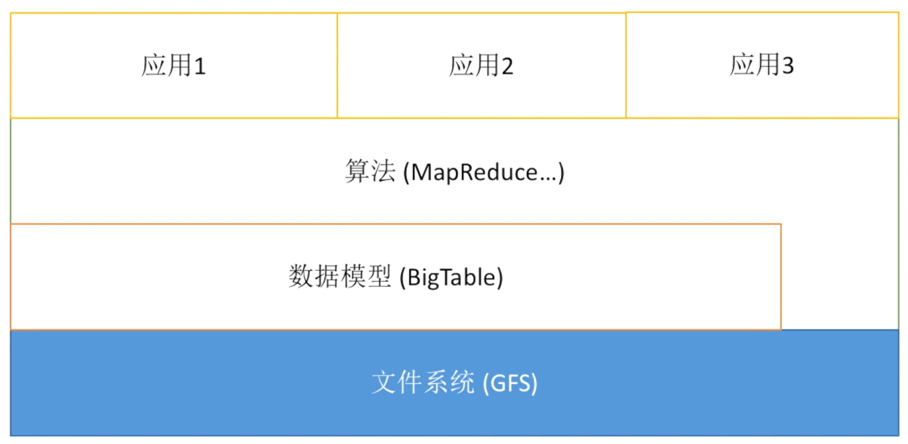

## GFS

&emsp;&emsp;GFS特定应用于存储大文件的场景，而其读写过程是核心。下面我将从如何存储一个一般文件开始，逐渐引入GFS在存储大文件时一些特有的特性以及模型。

### 如何保存普通文件

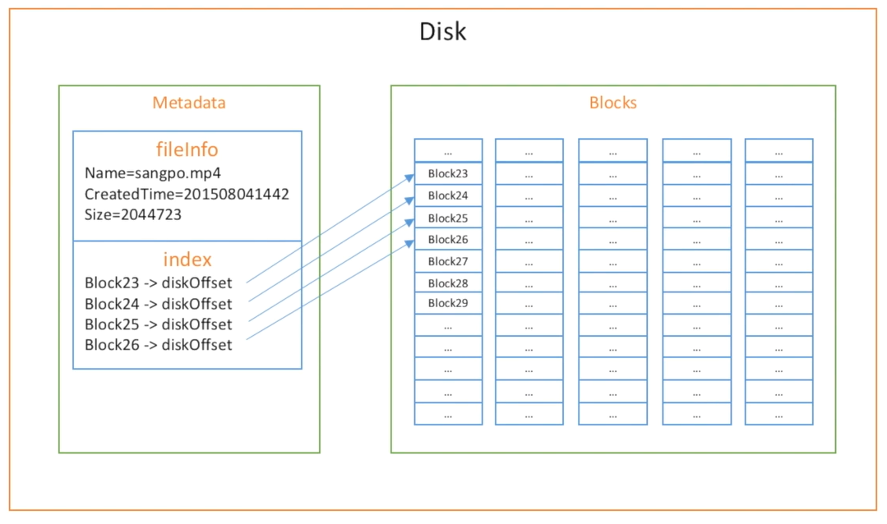

&emsp;&emsp;对于一般的文件，硬盘中记录两类数据：**元数据**（Metadata）、**块数据**（Blocks）

- 元数据：记录文件的基本信息（文件名、创建时间、文件大小等）以及对应数据块在磁盘上存放的索引信息（一般为地址偏移）；
- 块数据：真实文件的数据片段，一般来说1 block = 1024 Byte；

### 保存大文件

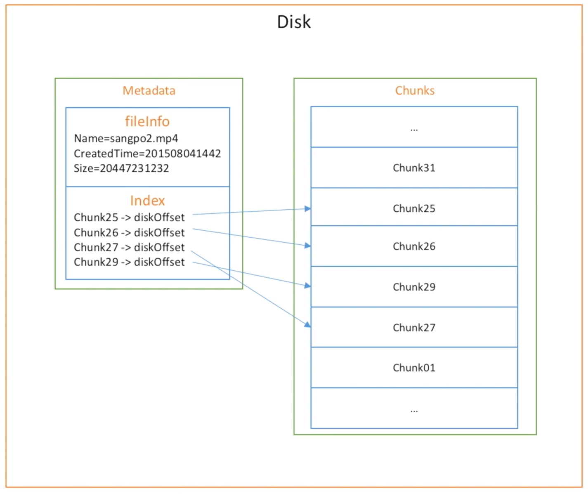

&emsp;&emsp;对于大文件，通过扩大单个数据存储单元的容量，将Block聚合成为Chunk，从而实现大文件的存储。

- 关键点：

  - 1 chunk = 64MB = 64*1024 = 65536 blocks

- 优点：

  - 减少元数据（索引减少）；
  - 减少流量（传递的索引信息、备份信息）；

- 缺点：

  - 小文件浪费空间；

  

### 保存超大文件

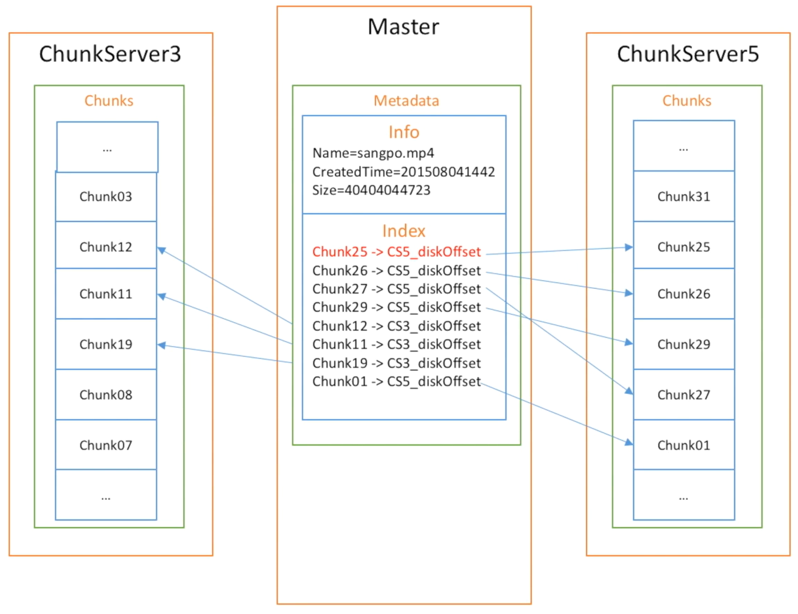

&emsp;&emsp;对于超大文件，将元数据与大块数据分别存储在不同的物理介质中，从而提高文件读写效率以及安全性。

- 关键点：
  - Master + Many ChunkServers
- 缺点：
  - ChunkServer数据的任何改变都需要通知Master；
  - 极大浪费Master的存储空间以及流量；

#### 改进方法：

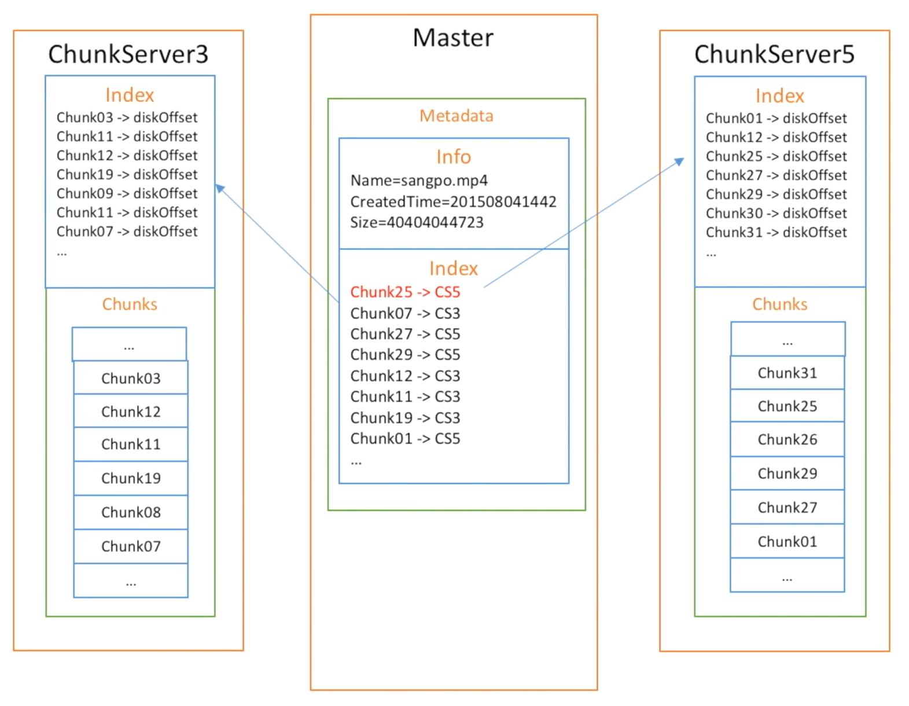

- Master不再记录每块数据的索引信息（diskoffset），只记录数据块所在的ChunkServer编号；
- 由ChunkServer自己记录每一个chunk的索引信息；

**优点**：

- 减少Master的元数据信息；
- 减少Master和Chunkserver之间的通信；

### 数据块损坏检验

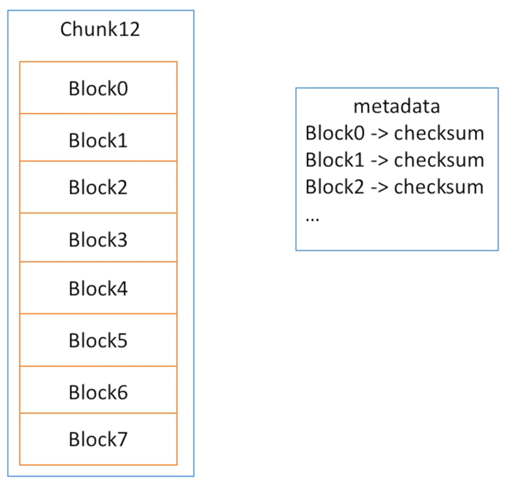

&emsp;&emsp;GFS检查文件是否出错的方法是对每个Chunk（a list of blocks）计算其Block（64KB）的校验和（checksum），并保存在元数据中。

&emsp;&emsp;每个checksum的大小为32bit，那么1T文件的校验和大小为：1T/64KB*32bit = 64MB，其占用存储空间的大小在可接受范围内。

&emsp;&emsp;在读取文件时，需要对当前正在读取的数据块进行checksum验证；

### 数据块冗余机制

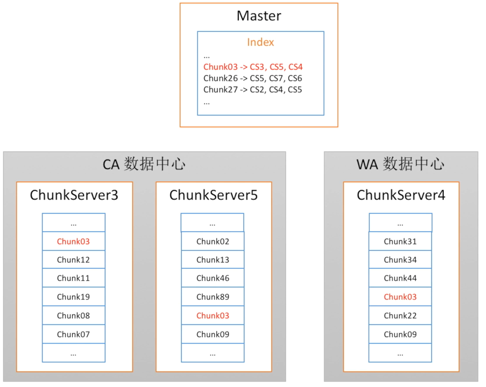

&emsp;&emsp;在GFS中，通过创建冗余副本的方式来减少ChunkServer出现故障时带来的损失，一般情况下创建副本的数量为：**3**

&emsp;&emsp;副本存储服务器的选择标准：

- 硬盘利用率低；
- 限制最新数据块的写入数量

&emsp;&emsp;注：此举是为了避免副本数据过于集中、以及热点数据访问等问题

- 跨中心、跨机架的存储模式（2+1）

### 数据块恢复

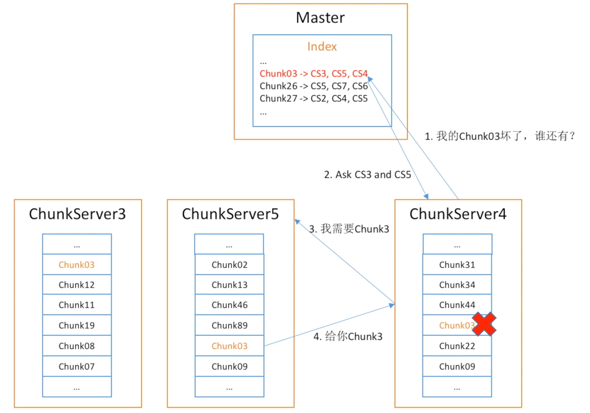

&emsp;&emsp;当发生文件数据块丢失的情况时，

1. 丢失数据块的ChunkServer向Master求助，由Master查找数据块索引表；

2. 告知数据块副本所在的ChunkServer；
3. 由丢失数据块的服务器向邻近包含所需数据块的ChunkServer发出复制请求；
4. 接收请求的服务器将副本数据块传递给所需的服务器；

### ChunkServer监测

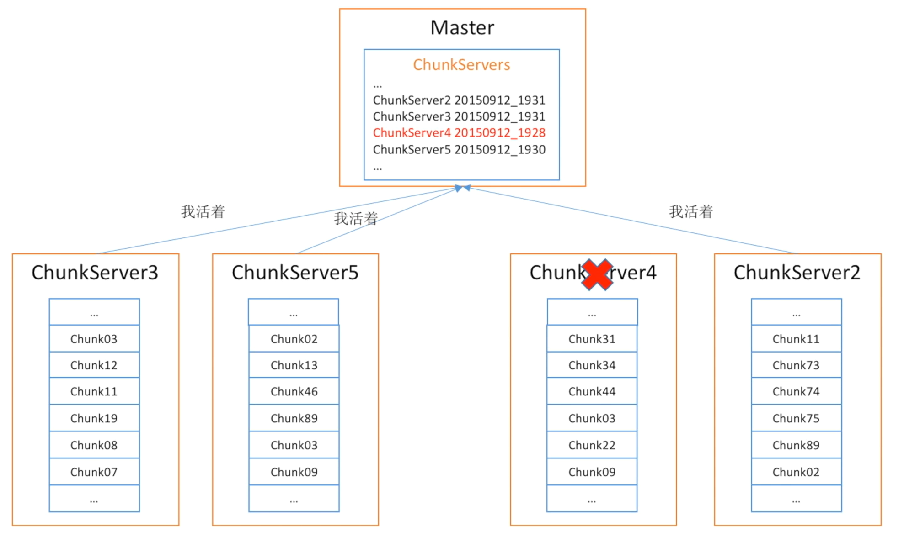

&emsp;&emsp;通过ChuckServer发送定时的**心跳报文**到Master判定ChunkServer的存活情况，并由Master维护“ChunkServer存活表”

&emsp;&emsp;注：在新的模式中，当Master无法正常接收某一ChunkServer的心跳报文时，会要求其他存活的ChunkServer服务器去连接“目标服务器”，借此判断目标服务器是出现故障了，或者仅是发生网络故障。

### ChunkServer故障后数据恢复

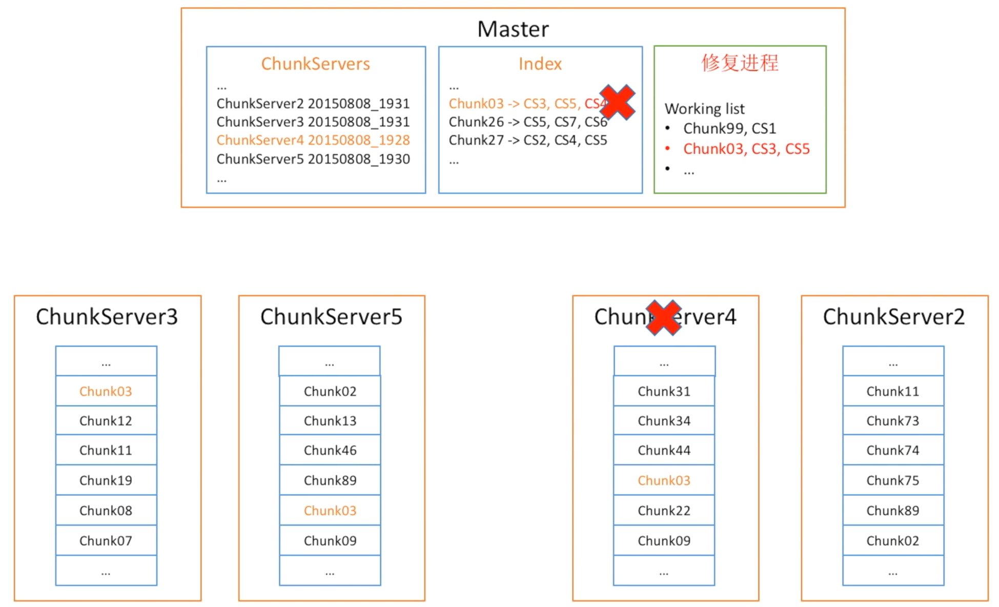

&emsp;&emsp;当确定ChunkServer出现故障后，Master就会启动修复进程。GFS的修复进程基于存活副本数的策略，即：某一数据块存活ChunkServer越少，修复的优先级越高。

### 热点数据

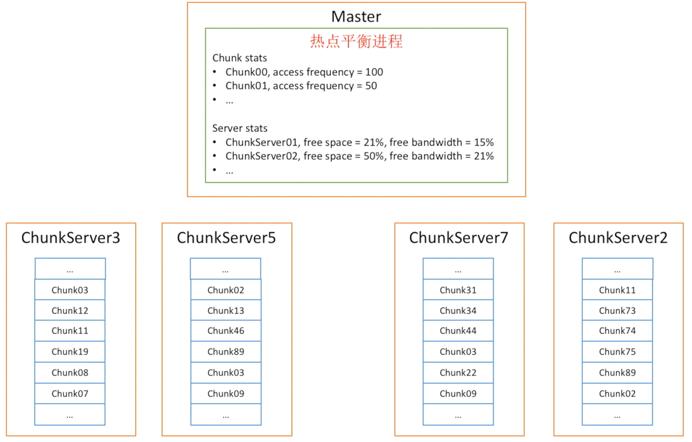

&emsp;&emsp;GFS在面对热点数据时，主要采取如下策略：

- 当副本过度繁忙时，复制到更多ChunkServer中；
- 基于ChunkServer的硬盘和带宽利用率来进行负载分担；

### 读文件过程

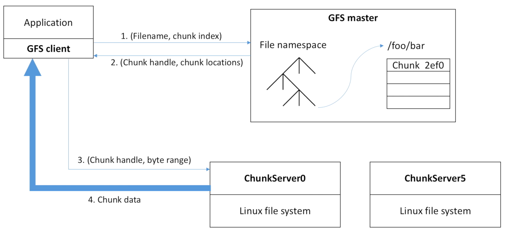

&emsp;&emsp;GFS系统的读取文件交互流程如下：

1. 应用通过GFS客户端（代理）向GFS Master发送所需的文件的文件名以及数据块的索引信息（Client计算得到）；

   注：由于GFS系统中chunk大小固定（64M），因此client可以通过计算得到文件数据块的偏移量，进而得到其索引。

2. Master在接收到请求后，向Client发送Chunk的Handle（也即数据块的获取权限），以及数据块所在的ChunkServer位置信息；

3. Client在获取到Chunk Handle后，向包含目标Chunk的ChunkServer申请数据，同时传递需要读取的数据大小（byte range）；

4. ChunkServer向GFS Client 返回数据；

&emsp;&emsp;需要注意的是，ChunkServer也是建立在Linux File System之上，因此也保留着Linux文件系统的相应特性；

### 写文件过程

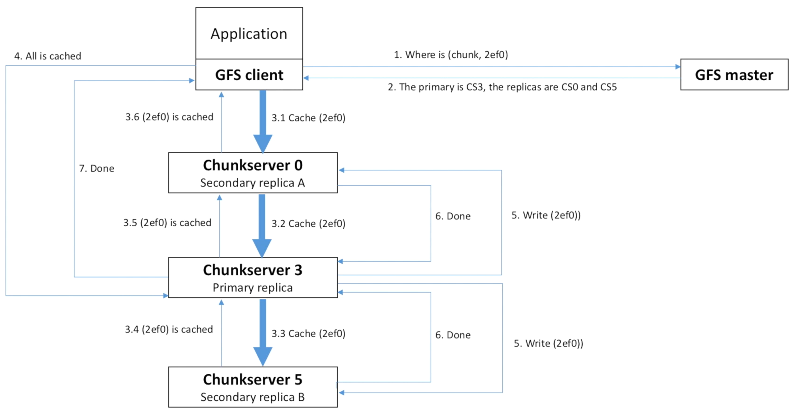

&emsp;&emsp;GFS的文件写入流程如下：

1. Client向Master申请写入某一文件的某一块（图中的2ef0为Client计算出的数据块偏移量）；

2. Master向Client指定存储Chunk的服务器（3个），同时指定其中的一个为“主服务器”；

   注：指定“主服务器”的目的是为了后续数据提交过程中的同步；

3. Client向**最近的**ChunkServer进行数据的提交，此过程为典型的3PC过程：

   3.1 Client向服务器传递数据，服务器接收数据后写入**缓存**中；

   3.2-3.3 由最先接收到数据的服务器（一般为离客户端最近的ChunkServer），向其他服务器传递数据，并写入缓存；

   3.4-3.6 完成缓存的服务器向其上级服务器发送“cached”指令，代表已成功完成缓存工作；

4. Client在接收到所有ChunkServer的确认信息后，向“主服务器”发送“写入指令”（写入磁盘）；

5. 由“主服务器向其他“从服务器”发送写入指令，完成写入操作；

6. 写入完成后，”从服务器“向”主服务器“发送完成写入的指令；

7. 当所有ChunkServer都完成写入任务后，由”主服务器“向Client发送”完成“反馈；

&emsp;&emsp;GFS系统中，遵循“奥卡姆剃刀原则“，即简单的事简单处理。因此，在遇到chunk某一备份写入异常的时候，GFS系统自身并不会通过复杂的机制进行修复。而只将错误报告给Client，由Client决定如何处理。这样极大简化了系统的复杂度，也减轻了Master的任务负担。
