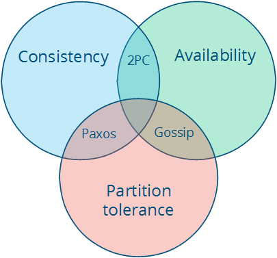
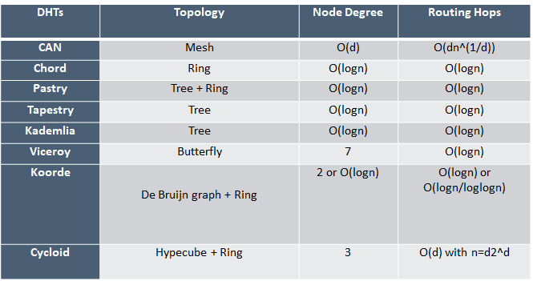

# Distributed-Systems
The Record of Distributed Systems Learning

针对分布式系统(云计算、去中心化网络)中的一些知识进行学习记录：

- [分布式系统经典书籍翻译](./book/README.md)
- [共识算法](./共识算法/README.md)
- [DHT算法](./共识算法/README.md)

对于分布式系统而言，必须满足的是CAP准则，即：
-	**一致性**(Consistency)：所有的节点在同一时间看的数据是一样的；
-	**可用性**(Availability)：节点故障不会阻碍到依旧存活的节点继续工作；
-	**分区容忍**(Partition tolerance)：因消息丢失导致网络或节点故障，系统仍能继续运作；

**注意**：定理中间部分（三个属性的交集）是无法实现。我们共得到三种系统类型：
-	**CA（一致性+可用性）**：例子包括完全严格的仲裁协议，如二阶段提交。
-	**CP（一致性+分区容忍**）：例子包括多数仲裁协议，其中少数分区不可用，例如Paxos。
-	**AP（可用性+分区容忍）**：例子包括使用冲突解决的协议，例如Dynamo。

基于CAP理论，面对大规模、多节点、去中心化的分布式系统，就衍生出两个亟待解决的挑战：
1. 如何保障节点间数据的一致性——**共识问题**；
2. 在去中心网络环境下，如何最大程度上保证节点的稳定性、可用性（能够持续在线提供服务）——**激励机制**；

基于上述的准则，针对“共识问题”，提出了一系列针对不同应用场景的**共识算法**，而发展至今主要可以分为两类：
- 以Paxos为基础而衍生出的一系列的，适用于有限、小规模分布式系统的一致性算法；
- 由“中本聪”所提出的PoW（工作量证明）及后续不断发展，基于“博弈论”的一系列适用于大型、复杂网络的共识算法；

而DHT作为分布式数据库的理论模型，根据不同的设计方式衍射出了诸如：CAN、Chore、KAD、Pastry等一系列算法，其特点如下所示：

&emsp;&emsp;针对日渐复杂的网络环境和海量数据，如何针对不同的应用场景选择并优化分布式数据库，来达到查询速率的提升，也是分布式系统所面临的重大问题
