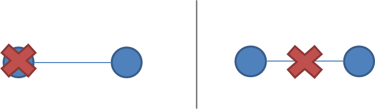

##2.抽象的升级和降级

在本章中，我们将讲述抽象升级和降级（译者：也可以理解成高层和底层），看到一些不可能结果（CAP和FLP），然后为了性能，对抽象进行降级。

如果你做过程序员，那么对于抽象层级这个概念应该是不陌生的。我们经常学习一些抽象层级，通过一些API访问底层，并可能需要进行封装，为自己模块使用者提供一些高层的接口。同样的例子还有OSI网络七层协议。

可以这么断言，分布式编程大部分是为了处理分布带来问题。即第一章所说的，开发者希望分布式系统能够如同一个单机系统工作的意愿（译者：便于理解进行编程）与分布式系统由多节点组成的现实之间的冲突。这意味着我们需要找到一个好的抽象。它可以在易于理解和性能做出权衡。

如果提出两个抽象X和Y，如何判断X比Y更抽象呢？首先，与Y对比时，X不会引入新的内容或与其在根本上有什么不同。事实上，X可能会移除Y的某些 内容或以某种更加易于管理的方式去呈现内容。第二，X在某种意义上比Y更加易于掌握。这建立在与Y相比时，X移除的内容无关紧要的前提上。

正如尼采而言
>Every concept originates through our equating what is unequal. No leaf ever wholly equals another, and the concept "leaf" is formed through an arbitrary abstraction from these individual differences, through forgetting the distinctions; and now it gives rise to the idea that in nature there might be something besides the leaves which would be "leaf" - some kind of original form after which all leaves have been woven, marked, copied, colored, curled, and painted, but by unskilled hands, so that no copy turned out to be a correct, reliable, and faithful image of the original form.

抽象，从根本上而言，是错误的。每一个场景都是独一无二的，正如每一个节点。但抽象使得世界易于管理：简单的问题描述-脱离现实中繁文冗节-能更加易于分析和不容易忽略事物的本质，因此方案也可以广泛适用。

如果我们掌握的东西是本质的，那我们推理出来的结果也是普适的。这也是为什么无法实现的结果是非常不重要的：对于问题，他们采取了最简洁的公式，说明在某些限制或假设下问题的无解。

所有的抽象都忽略一些东西，而支持一直独有的特征。这个技巧排除所有不必要的东西。但问题是，如何判断特征是否涉及事物的本质？是的，你无法提前得知。

每一次我们从系统规范中排除某些方面，就会冒着引入错误或性能问题的风险。这也是为什么我们需要从另一个角度切入，有选择地引入一些真实硬件和真实世界中某些问题。重新引入某些特定的硬件特性（如，物理顺序）或其他物理特性去获得足够的性能。

根据这个观点，关于分布式系统，我们需要掌握的最低限度的现实是那些呢？系统模型就是我们认为重要的某些特性的规范；指定一个，我们可以看到一些不可能实现的结果和挑战。

###系统模型
分布式系统的一个重要属性就是分布。更具体地说，运行在分布式系统的程序：

- 在各个独立节点并发地运行
- 通过网络进行交流，因此引入不确定性和消息丢失问题
- 没有共享的内存或时钟

这意味着：

- 每个节点并发地执行着一个程序
- 信息本地化：节点们对于自己的本地状态能够快速获取，但对于系统全局信息获取是延迟的
- 节点可以独立地失效并从失效中重启
- 节点间的信息会延迟或丢失（与节点失效无关，但实际中很难区分网络故障和节点失效）
- 节点之间时钟难以同步（本地时间与全局时序并不是对应的，并且这很难实时观察）

一个系统模型会列举许多关于一个指定系统设计的许多假设：

>**System model**

>a set of assumptions about the environment and facilities on which a distributed system is implemented

系统模型对于环境和假设的假设是不同的。这些假设报错：

- 系统具有什么功能以及他们可能如何失效
- 通信链接如何运行以及他们可能如何失效
- 整个系统的属性，如关于时间和顺序的假设

一个鲁棒的系统模型是一个需要最弱假设的模型：为这么一个系统写的任何算法可以容忍不同环境，因为它建立在很少且很弱的前提上。

另一方面，我们可以基于比较强的假设下，创建一个易于推理的系统模型。例如，假设所有节点不会失效，这样算法就不需要处理任何节点失效情况。然后，这样一个系统是不现实的且难以应用于实践的。

让我们来深入节点属性，链接，时间和顺序的更多细节。

#####系统模型中的节点
节点作为计算和存储的主机，他们拥有

- 执行程序的能力
- 在易失性的内存（节点失效后会丢失数据）中存储数据和进行持久化（能够从失败中恢复数据）的能力
- 时钟（不保证正确性）

节点执行确定的算法：本地计算，计算后的本地状态和发送由接受的消息及计算后的本地状态确定的消息。

存在许多描述节点失效方式的模型。事实上，大部分系统指定了一个崩溃-恢复的失败模型：节点只能因为崩溃而失效，并（可能）能够恢复到崩溃前的某些时间点时的状态。（**读者注，这里的崩溃错误（crash fail）一般也称作非拜占庭错误，即节点因为崩溃而不响应但不会伪造发送信息**）

也有另一个选择，那就是假设节点可以因为任意错误操作而导致失效（**读者注，这种错误也被称为拜占庭错误，即伪造恶意的信息**）。这里面最著名的模型就是拜占庭模型（**读者注，这可能是这种错误被称为拜占庭错误的原因？**）。

现实中，拜占庭模型很少应用在商业系统上。因为对于任意错误都具有弹性处理的算法执行起来相当昂贵并且更难以实现。我将不会在这里讨论它。（**读者注，相关算法是存在的。但拜占庭模型因为“捣乱者”存在更难达成共识。任何处理都是需要成本的，共识也是如此。而拜占庭达成共识还需要在节点之间的信任花费更多**）

通讯链接连通每个节点与其他节点，并允许信息双向流通。很多书讨论分布式算法，都假定每个节点存在一条单独通讯链接：它提供了FIFO（先进先出）的消息顺序；它仅分被发送的消息，并且发送的消息可以丢失。

一些算法假定网络是可靠的：消息永远不会丢失且也不会有无限期地延迟。对于某些实际设置来说，这是一个合理的前提。但最好考虑网络不可靠，并且会收到消息丢失和延迟的影响。

当网络故障而节点保持运行时就会出现网络分区。当网络分区出现时，消息可能丢失或延迟直到网络分区被修复。分区的节点可能可以被某些客户端访问，因此必须与崩溃的节点区别对待。下图说明了一个失败节点和网络分区的区别。

很少会对通讯链接做进一步的假设。我们可以假设链接仅有一个方向起作用，或者我们可以为不同的连接引入不同的通信成本（如，因为物理距离导致的延 迟）。然而，除了长距离链接（WAN延迟）意外，在商业环境中很少会关心这些问题，因此在此不再赘述。关于更详细的成本和拓扑结构的模型可以以复杂度为代 价进行更好的优化。

#####时间/顺序假设
物理分布的一个后果就是每个节点以独特的方式去体验世界。这是不可避免的。因为信息最快只能以光速传播。如果节点之间的距离互不相同，任何信息从一个节点到其他各个节点需要的时间也不同，并且可能以不同的顺序到达。

时间假设

>**Synchronous system model**

>Processes execute in lock-step; there is a known upper bound on message transmission delay; each process has an accurate clock

>**Asynchronous system model**

>No timing assumptions - e.g. processes execute at independent rates; there is no bound on message transmission delay; useful clocks do not exist

同步系统模型在时间和顺序施加了许多限制。它基本上假设节点有相同的体验：被发送的消息会在一个特定的最大传输延迟内被接受，并且这个过程会在锁定的步骤内进行。这是非常方便的。因为它允许你作为一个系统设计者，可以对时间和顺序做出假设，而这是异步系统无法做到的。

异步模型没有时间和顺序上的限制，因此基于该模型无法做出假设。

解决同步系统模型中的问题更容易，因为在执行速度，最大消息传输延迟和时钟准确性上进行进行假设都有助于解决问题。你可以基于这些假设来进行推断，并通过假设某些情况不会发生来排除某些难以处理的错误场景。

当然，同步模型现实中可行性不高。实际中，网络容易受故障影响，并且对消息延迟没有严格的限制。实际系统中只有部分同步：有时候系统会正常工作并保 证一些上限（如，延迟等），但有时候也会无限期延迟并且时钟不同步。本文不会详细讨论同步框架下的算法，但是读者可能在许多其他入门书看到。因为它们在分 析上比较容易（但不切实际）。

#####共识问题
在文章剩下部分，我们会讨论修改系统模型的参数。接下来，我们看看如何改变两个系统属性：

- 错误模型是否包含网络分区
- 假设时间是同步还是异步

通过讨论两个无法实现的结果来决定系统设计时的选择。

为了能够得出一个结论，我们需要解决一个问题：共识问题

几台电脑（或者节点）如果集体赞成某些值，那么我们就说他们达成了共识。更规范地：

	1.约同性（Agreement）：不同节点最终完成决策的结果是相同的
	2.完备性（Integrity）：每一次进程只能提议一个值。如果得到多个值，那么他们就是多次
	进程得到的。
	3.可终止型（Termination）：一致的结果在有限时间内完成
	4.合法性（Validity）：如果所有节点都提议同个值，那么这个值就是最终决策的结果。

**（读者注：
现在有这么一个分布式购票系统，它存在多个购票点（节点）。但每一张票都只能被一个节点的一个人购买，否则会重票。为这个系统设计的分布式算法应该**

    1.约同性：两个购票点同时对一张票发起了购买时，最终两个购票点必须达成
	同个结果：一个购票点完成购买，另一个被拒绝。

    2.完备性：每一次购票点的一次投票都只能有一个结果。不能同意把票给A购票点的同时还把票售于
	B购票点。

    3.可终止型：购票点发起的购买请求必须在一定时间内得到恢复。

    4.合法性：如果所有的购票点同意某种票由A购票点得到时，那票就是A购票点的。

**上述描述为译者理解**

**且在很多文档里，完备性和合法性是统合在一起的。**

**这里还有一个问题，就是上述的实现在实际中可能非常复杂。如，两个节点同时发起的购买，理论上应该先到先得，但之前我们就知道，实际中异步系统才是主流。而异步系统的时间和顺序是难以限制的。到底是谁先发起的购票是不可能的。况且可能两座城市还存在时差等等。)**

共识问题是许多商业分布式系统的核心。毕竟，我们想要一个切合实际的高性能分布式系统且不用不得不去处理分布后果（如：脑裂）。解决共识问题的同时，可能也需要解决几个相关的，更进一步的问题，如原子广播和原子提交

#####两种不可能结果
第一种无法实现的结果，称为FLP。它与设计分布式算法的人相关。

第二种无法实现的结果-CAP理论-则与从业人员相关；从业人员需要做不同的系统设计中做出选择，但不会直接参与算法的设计。

#####FLP
本节只大概描述FLP不可能结果的主要内容，虽然它在学术圈里被认为更重要（读者注：相比CAP）。FLP不可能结果（发明者：Fischer, Lynch and Patterson）在异步系统下测试了共识问题（严格来说，是约同问题，公式问题的一部分）。它有如下前提：只处理非拜占庭错误（crash fail）；网络可靠；异步系统，因此网络延迟没有限制。

在这些前提下，FLP讲述这么一个事实：在网络可靠，但允许节点失败（非拜占庭错误，最多只有一个）的异步模型中，不存在一个可以解决一致性问题的确定性共识算法。

这个结论意味着，在一个不会无限制延迟的最小化模型，不存在解决共识问题的方法。论据是，如果这么一个算法存在，那么以此设计一个程序，将可能在异步系统所允许的无限制的消息延迟中维持“bivalent”。因此，这个算法不存在。

**（读者注，这里原文就讲的很不清晰。因为我们需要重点放在FLP的本身，而不是证明。严谨的证明是一个图论证明，可以去相关论文 看。现在大概讲下这里的证明。假设决策的输出范围是[0,1]。那么为了达成一致性，每个节点每次提议最终是其中一个。当一个节点无法确定是输出0或者 1，那它就是"bivalent"。初始时，当提案未提出时，节点允许是“bivalent”。但当提案提出后，所有节点都应该确定一个值，来达成共识， 不允许当提案提出后，还有节点处在“bivalent”。但，一个无限延迟的消息，却可能出现这么一个节点无法意识到提案的提出，一直是 “bivalent”，从而达不成共识。**

**举例说明下，同样是购票问题，当对一种票还未有购票点进行请求购买时，它的归属是未确定的。此时所有节点初始都是 “bivalent”。但当两个购票点A和B同时提出了购票请求时，那么此时一定要决策出哪个购票点来获得这种票，A或者B。假设系统只有三个购票点，第 三个是C。A或B决策的解决方法是两个购票点把请求发给C，C先获得哪个请求，就把票投给谁，最后完成决，把票卖给那个购票点。但异步系统下，C购票点可 能永远都不会回应二者的请求，可能发给C的请求无限延期了，可能是C决策的消息无限延期了。C永远是“bivalent”，共识无法达成。这不是一个严谨的证明，但有助于理解）**

这个不可能结果很重要。因为它告诉异步系统共识算法设计需要权衡：在无法限制消息延迟下，要么放弃safety，要么放弃liveness。

这种结论主要与设计算法的人员相关。因为它告诉人们为异步系统的共识问题解决有一个严格的限制（**读者注，从理论本身出来，根本无法为异步分布模型设计一个可以容忍错误的共识算法。但理论不行，不代表实践不行。工程中往往可以通过额外付出一些代价来实现，这也就是CAP理论**）。CAP理论是与从业人员更相关的一个定理：它做了稍微不同的假设（网络故障而不是节点故障），并对从业人员在系统设计之间的选择具有更明显的含义。

###CAP理论
CAP定理最初是计算机科学家Eric Brewer提出的一个猜想。在设计者权衡系统保证时这是一种流行且相当有用的方法。Gilbert 和 Lynch 甚至对它进行了 正式的证明 。尽管是在 特定场景 下，但 Nathan Marz 并没有揭穿。

定理阐述三个属性：

- **一致性**：所有的节点在同一时间看的数据是一样的
- **可扩展性**：节点故障不会阻碍到依旧存活的节点继续工作
- **分区容忍**：就算因消息丢失导致网络或节点故障，系统仍能继续运作

同时只能够满足两个条件。从三选二，对应不同的交点一共有三种类型的系统。作图如下

注意，定理中间部分（三个属性的交集）是无法实现。我们共得到三种系统类型：

- CA（一致性+可用性）。例子包括完全严格的仲裁协议，如二阶段提交。
- CP（一致性+分区容忍）。例子包括多数仲裁协议，其中少数分区不可用，例如Paxos。
- AP（可用性+分区容忍）。例子包括使用冲突解决的协议，例如Dynamo。

CA和CP系统设计都提供了相同的一致性模型：强一致性。唯一的区别是CA系统不能容忍任何节点故障。而CP系统可以在非拜占庭错误模式下，一个有2f+1个节点的系统容忍高达f个节点故障（换句话说，它可以容忍少数f个节点故障当多数f+1节点存活时）。原因很简单：

- CA系统无法区分节点故障和网络故障。因此必须禁止在任何地方接受数据写入，避免出现分歧（多个数据版本）。它不能区分远端节点宕机还是二者间网络链接中断。所以唯一的解决方案就是拒绝数据写入。
- CP系统通过在两片分区执行不同的操作来防止引入分歧（eg 维持数据单版本一致性）。它仅保留包含大多数节点的分区，并要求包含少数节点的分区不可用（eg 停止写入数据）。这维持一定程度的可用性（包含大多数节点的分区）和保持单数据版本一致性。

我将在复制章节中对Paxos更深入的讨论。现在重要的是，CP类型的系统将网络分区整合进了故障模型中，并能通过算法，如Paxos，Raft 等，区分多数节点分区和少数节点分区。CA类型的系统是无法区分分区的，并且更有历史渊源：他们通常使用二阶段提交算法，并且在传统的分布式关系型数据库中更常见。

假设出现分区，定理就简化为可用性和一致性之间的选择。

其中，我们可以从CAP定理中得到4个结论:

**第一**、早期许多分布式关系型数据库设计并没有考虑分区容忍（都是CA类型设计）。分区容忍是现代系统的一个重要属性。因为随着地理分布（正如许多大型系统）越广，网络分区出现的概率越高。

**第二**、在网络分区下，实现强一致性和高可用之间存在矛盾。CAP定理就是强一致性和分布式计算之间权衡的一种阐述。

在某种意义上，要保证一个不可预测的网络下上多个独立节点组成的分布式系统能够“表现得与分布式系统一样”本身就非常疯狂。

强一致性保证要求我们在分区期间放弃可用性。这是因为当两个失联的分区都能继续写入数据时，数据分歧无法避免。

我们如何解决这个问题？通过加强假设（假设分区不会出现）或者削弱保证。可以在一致性和可用性（即脱机访问能力和低延迟）之间进行权衡。如果将“一 致性”重新定义为一种弱于强一致性（所有节点在同一时间点看到的数据相同）的一致性保证，那么我们可以同时拥有可用性和一些（更弱的）一致性保证。

**第三**、在正常的操作中，强一致性和性能之间存在矛盾。

强一致性/单数据版本一致性要求节点们在每一个操作上都能互相沟通并协同。这个结果会导致正常操作期间的高延迟。

如果你使用一个允许复制延迟或者分歧存在的一致性，而不是经典的强一致性，那么你可以降低正常操作中期间的延迟和在分区出现时维持可用性。

涉及的消息越少和节点越少，操作就可以更快完成。但实现这个的唯一方法是降低一致性保证：让一些节点之间的交流频率降低。这意味着部分节点可以包含旧数据。

**第四点**、表现的并不明显。如果我们不想在网络分区中放弃可用性，我们需要探索新的一致性模型，而非原来的强一致性模型。

举例如下，如果用户数据地理分布在多个数据节点并且两个数据中心的链接暂时出现故障，大部分情况下，我们仍然希望用户继续使用网页/服务。这意味着之后需要协调两组不同的数据。这既是技术挑战也是业务风险，但通常二者通常是可控的。因此它能更好提供高可用。

除非你被限制使用强一致性，否则一致性和可用性不是真的二元选择。但强一致性是唯一个可以在必要时，开发者能通过放弃可用性来防止数据出现多版本的一致性模型。正如 Brewer指出，3选2是一个谬论。

你还可以在上面的讨论中得到这么一个结论：“一致性”不是一个清晰的属性。记住，
>ACID consistency !=
>
>CAP consistency !=
>
>Oatmeal consistency

一致性模型是一个保证-任何保证-保证用户数据的存储，
>Consistency model

>a contract between programmer and system, wherein the system guarantees that if the programmer follows some specific rules, the results of operations on the data store will be predictable

CAP中的“C”就是特指强一致性，但实际中，一致性并不是强一致性的同义词。

让我们接下来看看相关的一致性模型。

###强一致性 VS 其他一致性模型
一致性模型被分为两大类型：强一致性模型和弱一致性模型

- 强一致性模型（拥有保持单版本数据的能力） 
   - 线性一致性
   - 顺序一致性

- 弱一致性模型 
   - 客户端为中心的一致性模型
   - 因果一致性模型：最强的模型
   - 最终一致性模型

强一致性模型保证命令顺序和数据更新表现与一个非复制系统一样。换句话说，弱一致性模型不会做这么一个保证。

请注意，上述列表没有包罗所有模型。一致性模型只是开发者和系统之间的任意约定，它可以被任意定义。

#####强一致性模型
强一致性模型可以进一步划分为两个相近的模型：

- 线性一致性模型：在线性一致性下，所有操作在每个节点都按照操作的全局实时顺序执行。(Herlihy & Wing, 1991)
- 顺序一致性模型：在顺序一致性下，每个节点上所有原生操作确定一个执行顺序。这也是其他节点执行这些操作的顺序。(Lamport, 1979)

关键的区别在于，线性一致性要求操作的执行顺序等同于实时操作顺序。顺序一致性允许操作重排序只要，主要单个节点上的操作不重排即可。区分二者的唯一方法是观察系统所有的输入和时序。从客户端与节点交互的视角来看，二者并没有区别。

**（读者注，二者之间的区别在于线性一致性关注了全局的执行顺序，而顺序一致性只关心节点内部命令的执行顺序。**

**举例，假设节点A执行操作a，b，节点B执行操作c，d。操作的实时执行顺序是：a，c，b，d,则线性一致性要求，所有节点的执行顺序都是a，c，b，d；而顺序一致性则可以是a，b，c，d或a，c，b，d或a，c，d，b或c，d，a，b或者c，a，d，b或c，a，b，d。只要保证节点内部命令执行顺序即可）**

强一致性模型允许一个开发者把单个服务器替换为分布式节点集群而不会遇到任何问题。

所有其他的一致性模型都存在问题（相比强一致性系统），因为他们表现与非复制系统不同。但这些问题通常是可接受的，因为要么我们不关心偶发问题，要么我们可以写一些代码去处理这些问题出现时带来的数据不一致。

值得注意的是，弱一致性模型没有通用的类型，因为“非强一致性”（eg 以某种方式与非复制系统区别开）可以是任何东西。

#####以客户端为中心的一致性模型
客户端一致性模型实现上涉及客户端或session概念。例如，客户端一致性模型保证客户端绝不会看到旧版本数据（**读者注，这里的旧相对于客户端当前持有的版本**）。这通常可以通过为客户端附加缓存来实现。如果客户端从一个复制节点读取到了旧数据，客户端就返回自己缓存的数据而不是读取到的旧数据。

如果客户端连接的复制节点没有最新版本的数据，那么客户端是可能看到旧版本的数据的（**读者注，这里的旧相对于系统当前的最新版本**），但他们永远不会看到数据版本的回退（eg 即便客户端连接到另一个复制节点）。值得注意的是，目前有许多一致性模型就是客户端一致性模型。

#####最终一致性模型

最终一致性是说，如果系统停止更改，那经过一段不确定的时间后，所有的副本将协同为同一个值。这意味着在时刻到来之前，副本之间的结果是不一致的。因为它仅本身难以满足要求 （仅活力属性），需要追加额外信息。

仅仅描述系统是最终一致性，就像说“人终究会死一样”，是一个非常弱的约束。我们可能希望至少需要系统两个方面的具体描述：

**第一**、“最终”是多久？对段时间有一个严格的下限或了解系统收敛到同一值通常需要多久是有意义的。

**第二**、所有副本是如何达成共识？一个永远回复“42”的系统也能是最终一致的：所有的副本会收敛到同个值。它只是不能收敛到一个有用的值（**读者注，所以这是一个无价值的最终一致性算法**），因为它永远都会返回一个固定值“42”。但我们希望有一个更好的方法来达到最终一致，例如，已知的一种方法是始终采用带有最大时间戳的值。

所以当设计者门说“最终一致性”，它通常是一个有更精确含义的术语，如“最终采用带有最大时间戳的值，读取带有最大时间戳的值”这种一致性。“实现方法”如此重要，因为不良的方法可能导致写入丢失（例如，如果一个节点上的时钟设置错误并采用了时间戳）。

接下来会在弱一致性模型复制方法这个章节更加详细讨论这两个问题的细节。