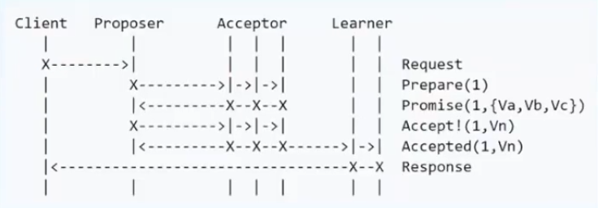
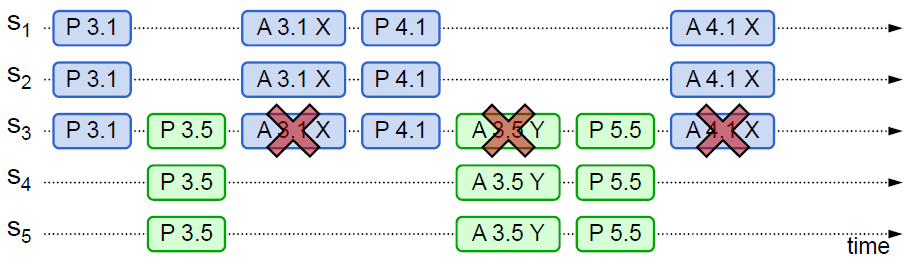

# Paxos算法简介

## 概述
> 一种基于消息传递且具有高度容错特性的 **强一致性算法**

&emsp;&emsp;注：强一致性，即数据要求时刻保持一致

### 解决的问题
&emsp;&emsp;如何快速正确的在一个分布式系统中对某个数据值达成一致，并且保证不论发生任何异常，都不会破坏整个系统的一致性。

### 分类
- **Basic Paxos**：最原始的Paxos算法；
- **Multi Paxos**：在Basic Paxos基础上提出的优化方案；
- **Fast Paxos**：为了提高收敛速度，在Multi Paxos基础上进一步优化的方案；

### 算法核心思想
1. 仅讨论并接受最新的“提案”；
2. 少数服从多数；

## Basic Paxos算法

### 角色分类：
-	**Client**：系统外部角色，请求的发起者；
-	**Proposer**：接受Client请求，向集群提出提议（proposal）。并在冲突发生时，起到冲突调节的作用；（注：Basic Paxos中Propser不唯一）
-	**Acceptor（Voter）**：提议投票和接收者，只有在形成法定人数（Quorum，一般为majority多数派）时，提议才会最终被接受；
-	**Learner**：提议接受者，不参与投票，仅充当backup（备份）的作用，对集群一致性没什么影响

   **注**：集群中每个节点都可能充当多个角色

### 算法流程

**注**：提案Proposal包含**编号N**、以及**内容Value**

&emsp;&emsp;1a. **Prepare**：proposer提出一个提案，编号为N，此N大于这个proposer之前提出提案编号。请求acceptors的Quorum（多数派）接受；
&emsp;&emsp;1b. **Promise**：如果N大于此acceptor之前接受的任何提案编号则接受；否则拒绝；
&emsp;&emsp;2a. **Accept**：如果达到了多数派，proposer会广播accept请求，此请求包含提案编号N，以及提案内容；
&emsp;&emsp;2b. **Accepted**：如果此Acceptor在此期间没有收到任何编号大于N的提案，则接受此提案内容，并备份提案的value；否则忽略；

如图所示：
- Si（i=1,2,…,5）为提案发起者（Proposer）；
- P（N）为发起的提案（N代表发起提案的编号）；
- A（N）为广播的accept请求；

1. 首先，由S1发起编号为P3.1的提案，得到S2、S3的投票（超过集群中半数以上的选票），提案进入Accept阶段。然而在Accepted之前，有来自S5发起的更新的提案P3.5，所以3.1提案被终止。
2. 在P3.5提案进入Accepted阶段前，有来自S1发起的编号更新的提案P4.1。所以，3.5提案被终止。
3. 后续进程同理，自始至终：只讨论、且接受提案编号大的提案。即提案想要被接受，需要在整个算法流程中没有编号更新的提案被提出。

### Basic算法优化方式
-	**Multi Paxos**：在集群所有Proposer中选取唯一的Leader进行“提案”的提交以及具体内容的传递，避免活锁的发生，同时简化流程

> 注：活锁，即每个Proposer都想自己的提案通过，因此在提案被否决后，proposer通过增大编号重复提交、抢占提案通道（如上图所示）

-	**Fast Paxos**：在Multi Paxos的基础上，当提案被讨论通过后，由提案的发起者直接向集群中其他节点传递提案具体值value，而不需要经过Leader的转发，提高数据达成一致的速率
